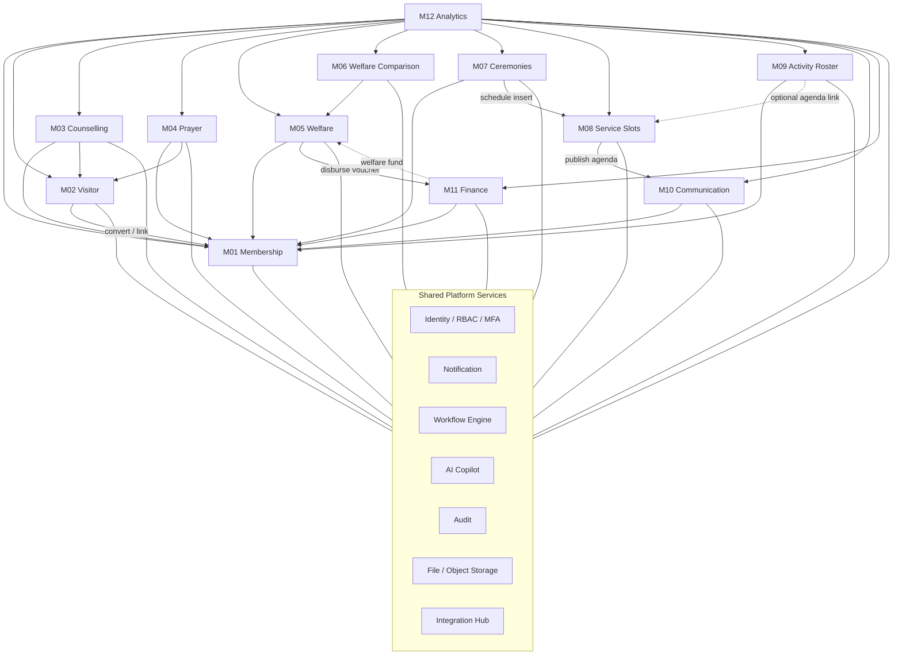

# Module Design Overview

| Field | Value |
|---|---|
| **Product** | Enterprise Church Management System (CMS) |
| **Document** | 04 — Module Design Overview |
| **Version** | 1.0 |
| **Date** | 2026-08-23 |
| **Status** | Baseline |
| **Related** | [00-INDEX](00-INDEX.md) · [01-BRS](01-BRS.md) · [02-FRS](02-FRS.md) · [05-USER-STORIES](05-USER-STORIES.md) · [modules/](modules/) |

---

## 1. Purpose

This document summarizes the **12 functional modules**, their dependencies, and the **shared platform services** every module consumes. Detailed design for each module lives under `modules/M01`–`M12`.

**Design principles**

- API-first (REST + GraphQL); web, iOS, Android, and member portal share contracts.
- Strict `tenant_id` isolation; optional `campus_id` scoping.
- AI is advisory; high-risk actions require human confirmation.
- No PII/PHI in logs or documentation examples (use `Member A`, `Visitor B`, `Case C-####`).

---

## 2. Twelve modules at a glance

| # | Code | Module | Spec | Primary actors | Depends on |
|---|---|---|---|---|---|
| 1 | `MEM` | Membership Management | [M01-membership](modules/M01-membership.md) | Admin, Pastor, Care Cell Leader, Member | Identity, File, Audit, Notification, AI |
| 2 | `VIS` | Visitor Management | [M02-visitor](modules/M02-visitor.md) | Volunteer, Care Cell Leader, Pastor | MEM, Workflow, Notification, AI |
| 3 | `COUN` | Counselling Management | [M03-counselling](modules/M03-counselling.md) | Counsellor, Senior Pastor | MEM, VIS, Workflow, Notification, AI, Audit |
| 4 | `PRAY` | Prayer Support | [M04-prayer](modules/M04-prayer.md) | Member, Prayer Team, Pastor | MEM, VIS, Notification, AI |
| 5 | `WEL` | Welfare Management | [M05-welfare](modules/M05-welfare.md) | Care Cell / Ministry Leaders, Pastor, Welfare Team, Treasurer | MEM, FIN, Workflow, File, AI |
| 6 | `WCE` | Welfare Comparison Engine | [M06-welfare-comparison](modules/M06-welfare-comparison.md) | Welfare Lead, Senior Pastor, Analyst | WEL, Integration (Power BI), AI |
| 7 | `CER` | Ceremonies & Member Functions | [M07-ceremonies](modules/M07-ceremonies.md) | Care Cell Leader, Elder, Pastor, Admin | MEM, SLOT, Workflow, File, Notification |
| 8 | `SLOT` | Service Slot Management | [M08-service-slots](modules/M08-service-slots.md) | Pastor, Elder, Ministry Leader | CER, COM, AI, Notification |
| 9 | `ROST` | Church Activity Roster | [M09-activity-roster](modules/M09-activity-roster.md) | Ministry Leader, Volunteer, Pastor | MEM, SLOT, Notification, Integration (M365), AI |
| 10 | `COM` | Communication & Digital Engagement | [M10-communication](modules/M10-communication.md) | Ministry Leader, Pastor, Admin | MEM, File, Notification, Integration, AI |
| 11 | `FIN` | Finance Management | [M11-finance](modules/M11-finance.md) | Treasurer, Finance Manager, Auditor | MEM, WEL, Workflow, Integration (Tally), AI, Audit |
| 12 | `ANA` | Analytics & Executive Dashboards | [M12-analytics](modules/M12-analytics.md) | Senior Pastor, Analyst, Finance Manager | All modules (aggregates), Integration (Power BI), AI |

---

## 3. Module dependency diagram

**Hard dependencies (runtime):** VIS→MEM (conversion), WEL→FIN (disbursement), CER→SLOT (agenda placement), WCE→WEL (case selection).  
**Soft dependencies:** ROST↔SLOT (sermon/agenda), COM←SLOT (publish), ANA←all (read-only aggregates).

---

## 4. Shared services

### 4.1 Identity (RBAC / MFA / SSO)

| Concern | Design |
|---|---|
| Tenancy | Every principal bound to `tenant_id`; campus claims optional |
| Roles (defaults) | Senior Pastor, Pastor, Elder, Counsellor, Care Cell Leader, Associate Care Cell Leader, Welfare Team, Ministry Leader, Finance Manager, Treasurer, Administrator, Auditor, Volunteer |
| MFA | Mandatory for Senior Pastor, Finance Manager, Treasurer, Administrator, Auditor |
| Field-level ACL | COUN notes, WEL narratives, sensitive FIN fields |
| SSO | Optional Microsoft 365 OIDC |

### 4.2 Notification

| Concern | Design |
|---|---|
| Channels | Email, SMS, WhatsApp, Push, in-app |
| Policy | Consent, channel prefs, quiet hours; Emergency may override with confirmation |
| Content safety | Never send confidential COUN note bodies or WEL bank details over SMS/WhatsApp |
| Delivery | Provider ids + status logged; no full message PII in app logs |

### 4.3 Workflow engine

| Concern | Design |
|---|---|
| Patterns | Linear approval, threshold matrix, parallel review, SLA escalations |
| Used by | MEM lifecycle, VIS follow-ups, WEL approval, CER dedication/banns, FIN SoD payments, ROST substitution |
| Audit | Every transition: actor, from/to state, reason, correlation id |

### 4.4 AI Copilot

| Concern | Design |
|---|---|
| Entry points | MEM, VIS, COUN, PRAY, WEL/WCE, SLOT, ROST, COM, FIN, ANA |
| Contract | Rationale + confidence; accept / edit / reject logged |
| Safety | No auto-approve of high-risk WEL/FIN; no auto-send of pastoral AI content |
| Privacy | Prompt scrubbing; feature flags per tenant; never train on tenant data without contract |

### 4.5 Audit

| Concern | Design |
|---|---|
| Scope | Auth, RBAC changes, mutations, exports, break-glass |
| Payload | Actor, action, entity type/id, timestamp, campus, correlation id — **no field values that are PII/PHI** |
| Store | Immutable / append-only; retention per tenant policy |

### 4.6 File / object storage

| Concern | Design |
|---|---|
| Types | PDF, JPG, JPEG, PNG, BMP, GIF, MP4 |
| Max size | **50 MB** per object |
| Email rule | Images + PDF only; **MP4 disallowed** on email channel |
| Controls | Virus scan hook, RBAC on download, signed URLs with short TTL |

### 4.7 Integration hub

| Integration | Consumers | Notes |
|---|---|---|
| WhatsApp Business API | COM, VIS, ROST, PRAY, WEL | Template-only outbound; webhooks |
| Email (SMTP / M365 Graph) | COM, all notify | Attachment policy enforced |
| SMS | Alerts, MFA, short reminders | Cost + quiet hours |
| Push (APNs/FCM) | COM, ROST, CER, VIS | Immediate / scheduled / recurring |
| Tally Prime (XML/API) | FIN | Ledgers, vouchers, bank recon; idempotent + DLQ |
| Microsoft 365 | Identity, ROST calendar, COM mail | OIDC + Graph |
| Power BI | ANA, WCE | Aggregate datasets; no confidential note bodies |

---

## 5. Domain highlights (product brief alignment)

| Module | Must-have domain specifics |
|---|---|
| MEM | Lifecycle statuses; family; baptism; transfer; classes; marriage/dedication links; classification; Care Cell; ministries; skills/talents; engagement scoring |
| VIS | Exact source enum; Day **1/3/7/14/30** follow-up; conversion pipeline |
| COUN | Fixed categories; risk **Low / Moderate / High**; confidential notes |
| PRAY | Fixed categories; teams; testimonies; AI prayer/scripture |
| WEL | Restricted requestors; approval chain; AI eligibility |
| WCE | ≤**5** cases; categories **A–I**; weighted scoring; Power BI export |
| CER | Full ceremony catalogue; dedication Care Cell→Elder→Pastor→Schedule→Certificate; banns/weddings |
| SLOT | Friday / Sunday / Special; program slots Before Worship … Before Closing Prayer; AI conflict detection |
| ROST | Sermons, counselling, hospital, care cell, worship, volunteers, Friday School; AI scheduler; Email/SMS/WhatsApp/Push |
| COM | Flyers/videos/announcements/events/devotions; file rules 50MB; Email no MP4 |
| FIN | Donations/tithes/offerings/welfare/mission/budget/cash/vendor/recurring; multi-currency; Tally; AI anomaly |
| ANA | Cross-module dashboards + AI insights (no confidential text) |

---

## 6. Cross-cutting NFRs (module view)

| NFR | Expectation |
|---|---|
| Scale | 100,000+ members / large tenant |
| Availability | 99.9% monthly core APIs |
| Performance | Interactive list/search p95 &lt; 2s; heavy exports async |
| Accessibility | WCAG 2.2 AA for web + portal (see [ux/06-SCREENS-AND-NAV](ux/06-SCREENS-AND-NAV.md)) |
| Multi-campus | Campus-scoped ops + org-wide executive rollups |

---

## 7. Document map

| Deliverable | Path |
|---|---|
| Membership | [modules/M01-membership.md](modules/M01-membership.md) |
| Visitor | [modules/M02-visitor.md](modules/M02-visitor.md) |
| Counselling | [modules/M03-counselling.md](modules/M03-counselling.md) |
| Prayer | [modules/M04-prayer.md](modules/M04-prayer.md) |
| Welfare | [modules/M05-welfare.md](modules/M05-welfare.md) |
| Welfare Comparison | [modules/M06-welfare-comparison.md](modules/M06-welfare-comparison.md) |
| Ceremonies | [modules/M07-ceremonies.md](modules/M07-ceremonies.md) |
| Service Slots | [modules/M08-service-slots.md](modules/M08-service-slots.md) |
| Activity Roster | [modules/M09-activity-roster.md](modules/M09-activity-roster.md) |
| Communication | [modules/M10-communication.md](modules/M10-communication.md) |
| Finance | [modules/M11-finance.md](modules/M11-finance.md) |
| Analytics | [modules/M12-analytics.md](modules/M12-analytics.md) |
| Screens & Nav | [ux/06-SCREENS-AND-NAV.md](ux/06-SCREENS-AND-NAV.md) |

---

## Document control

| Version | Date | Change |
|---|---|---|
| 1.0 | 2026-08-23 | Initial module design overview + shared services |
