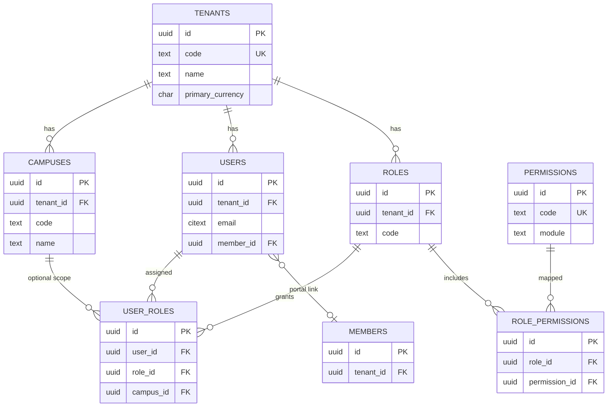
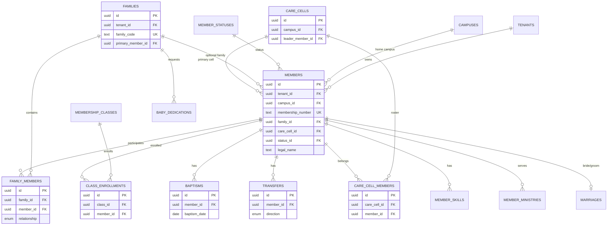
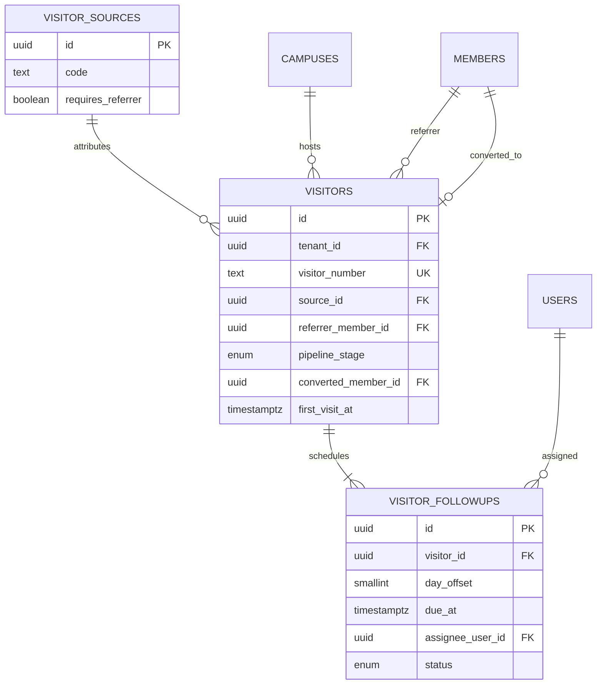
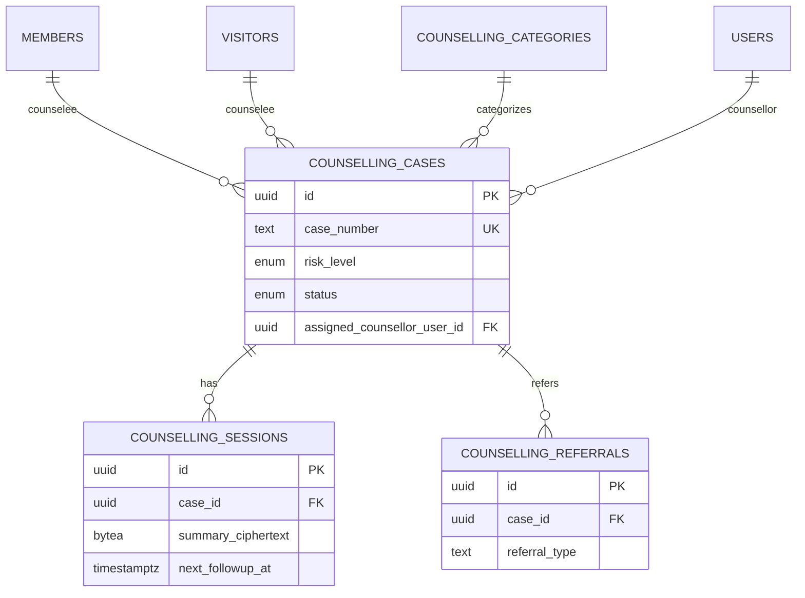
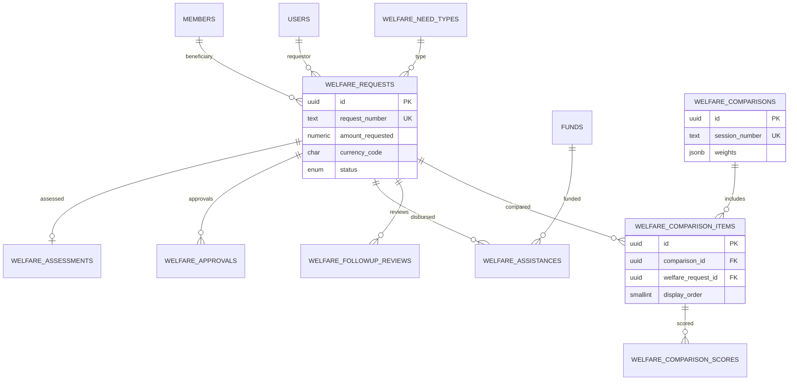
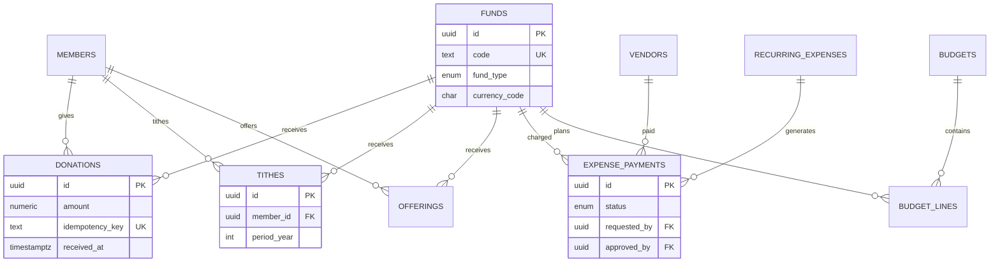

# Entity Relationship Diagram (ERD)

| Field | Value |
|---|---|
| **Product** | Enterprise Church Management System (CMS) |
| **Document** | 08 — ERD |
| **Version** | 1.0 |
| **Date** | 2026-08-23 |
| **Status** | Design baseline |
| **Related** | [07-DATABASE-SCHEMA](07-DATABASE-SCHEMA.md) · [schemas/](schemas/) · [api/09-API-SPEC](api/09-API-SPEC.md) |

> Placeholders only (`Member A`, `Visitor B`). No real PII.

---

## 1. Identity & tenancy

**Cardinality**

| Relationship | Card. | Notes |
|---|---|---|
| Tenant → Campus | 1:N | ≥1 campus per tenant |
| Tenant → User | 1:N | Email unique per tenant |
| User → Role | N:M | Optional campus scope on assignment |
| Role → Permission | N:M | System + custom roles |
| User ↔ Member | 0..1:0..1 | Portal users may link one member |

---

## 2. Member / family / care cell

**Cardinality**

| Relationship | Card. | Notes |
|---|---|---|
| Family → Member | 1:N | Member may be family-less |
| Family ↔ Member (junction) | N:M | Relationship typed |
| Care Cell → Member (primary) | 1:N | `members.care_cell_id` |
| Care Cell ↔ Member (history) | N:M | `care_cell_members` |
| Member → Baptism | 1:N | Multiple historical rare |
| Class → Enrollment | 1:N | Unique (class, member) |

---

## 3. Visitor domain

**Cardinality**

| Relationship | Card. | Notes |
|---|---|---|
| Source → Visitor | 1:N | Referrer required when flagged |
| Visitor → Follow-up | 1:5 | Day offsets 1/3/7/14/30 unique |
| Visitor → Member (convert) | 0..1:0..1 | Sets stage `converted` |

---

## 4. Counselling

**Cardinality:** Case has 0..N sessions and 0..N referrals. Exactly one of member/visitor counselee required. High risk triggers supervisor notification (app rule).

---

## 5. Welfare

**Cardinality:** Comparison includes **1–5** items. Each item has up to **9** scores (A–I). Assistance 0..N per request after approval.

---

## 6. Finance (core giving)

**Cardinality:** Giving rows optionally link member (offerings may be anonymous). Expense approver ≠ requester (SoD check).

---

## 7. Textual cardinality notes (summary)

1. **Hard tenant boundary:** every domain entity hangs off `tenants` (1:N). No cross-tenant FKs.
2. **Campus:** most operational entities are N per campus; executive queries omit campus filter.
3. **Soft delete:** relationships remain for audit; default reads exclude `deleted_at IS NOT NULL`.
4. **Conversion:** Visitor → Member is a lifecycle transition, not a subtype inheritance.
5. **Confidentiality:** Counselling session ciphertext is owned by case; access is role-filtered, not modeled as separate “note user” table.
6. **Partitioned tables** (`attendance_events`, `notifications`, `audit_log`, deliveries, snapshots, tally events) are **append-oriented**; ERD treats them as 1:N from tenant/user/entity without reverse navigation requirements.

---

## 8. Cross-module relationship matrix

| From \ To | MEM | VIS | COUN | PRAY | WEL | CER | SLOT | ROST | COM | FIN | ANA |
|---|---|---|---|---|---|---|---|---|---|---|---|
| **MEM** | — | referrer / convert | counselee | requester | beneficiary | subject | — | assignee | audience | giver | metrics |
| **VIS** | convert | — | counselee | — | — | — | — | — | audience | — | funnel |
| **COUN** | case link | case link | — | escalate* | — | counselling gate | — | duty type | reminders | — | trends |
| **PRAY** | requester | — | — | — | — | — | — | — | notify | — | volume |
| **WEL** | beneficiary | — | — | — | WCE | — | — | — | status push | fund/voucher | demand |
| **CER** | dedication/marriage | — | status block | — | — | — | slot insert | — | announce | — | counts |
| **SLOT** | — | — | — | — | — | hosts | — | — | publish | — | — |
| **ROST** | assignee | — | activity | — | — | — | — | — | assign notify | — | load |
| **COM** | segment | segment | non-sensitive | team | updates | ceremony | agenda | reminders | — | — | delivery KPIs |
| **FIN** | giving | — | — | — | assistance | — | — | — | anomaly alert | Tally | cashflow |
| **ANA / AI** | scores | conversion | risk hint* | draft* | eligibility* | — | optimize* | fair assign* | draft* | forecast* | store |

\*AI advisory only; human confirmation required for high-risk actions.

---

## 9. Document control

| Version | Date | Change |
|---|---|---|
| 1.0 | 2026-08-23 | Initial Mermaid ERD + matrix |
