# Workflows and Automation

| Field | Value |
|---|---|
| **Product** | Enterprise Church Management System (CMS) |
| **Document** | 10 — Workflows and Automation |
| **Version** | 1.0 |
| **Date** | 2026-08-23 |
| **Status** | Design baseline |
| **Related** | [03-USE-CASES](03-USE-CASES.md) · [api/09-API-SPEC](api/09-API-SPEC.md) · [02-FRS](02-FRS.md) |

> Diagrams use placeholders (`Visitor B`, `Member A`, `Case C-1001`). No real PII. Channels respect consent and quiet hours (FR-GLO-004).

---

## 1. Visitor follow-up cadence

### 1.1 State diagram — visitor pipeline + tasks

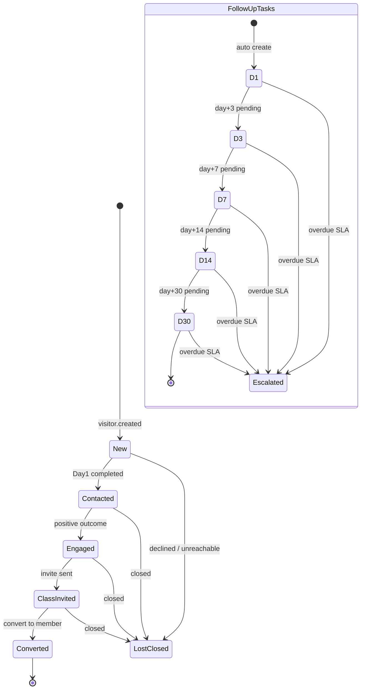

### 1.2 Sequence — create visitor and schedule Day 1/3/7/14/30

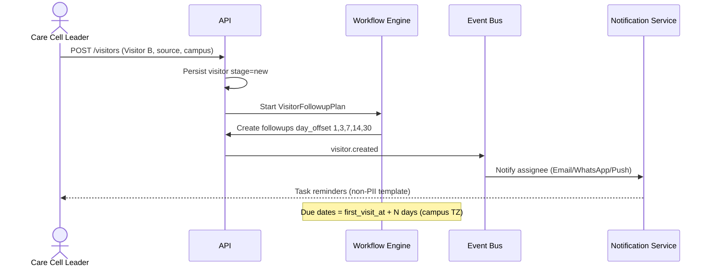

### 1.3 Sequence — complete task / escalate overdue

```mermaid
sequenceDiagram
  actor Owner as Assignee
  participant API as API
  participant BUS as Event Bus
  participant Pastor as Pastor

  Owner->>API: POST /visitor-followups/{id}/complete (outcome)
  API->>API: status=completed; maybe advance pipeline
  alt overdue job fires
    API->>BUS: visitor.followup.overdue
    BUS->>Pastor: Escalate (Push/SMS/WhatsApp)
    API->>API: status=escalated
  end
```

---

## 2. Baby dedication approval

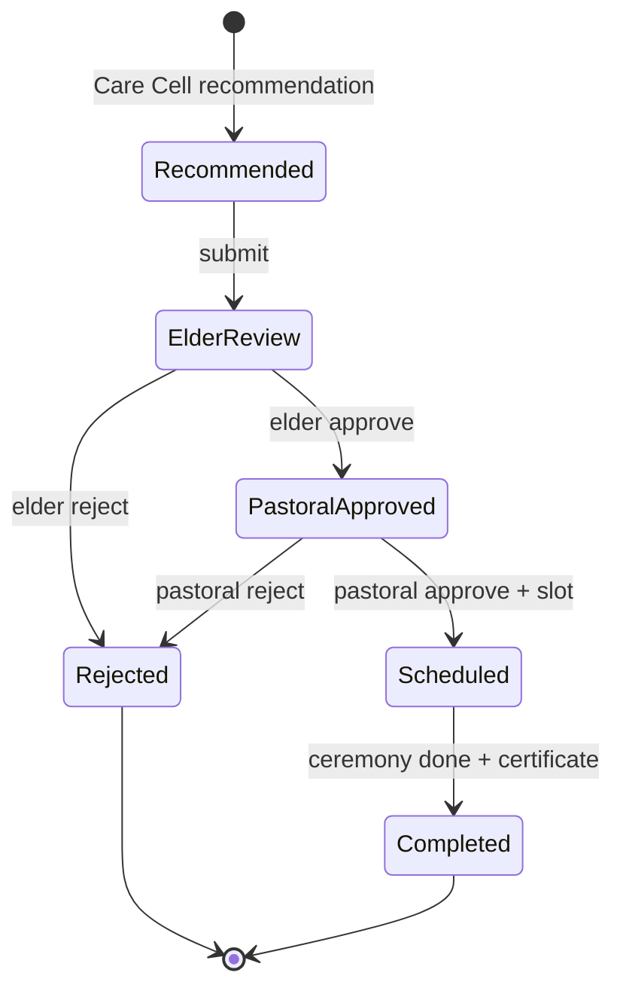

```mermaid
sequenceDiagram
  actor CCL as Care Cell Leader
  actor Elder as Elder
  actor Pastor as Pastor
  participant API as API
  participant SLOT as Service Slots
  participant NTF as Notifications

  CCL->>API: POST /baby-dedications (child placeholders, parents Member A)
  API->>NTF: Notify Elder Review
  Elder->>API: POST /ceremonies/{id}/approvals (elder)
  API->>NTF: Notify Pastor
  Pastor->>API: POST approvals (pastor)
  Pastor->>SLOT: Insert service slot item
  API->>NTF: Notify family stakeholders (Email/WhatsApp/Push)
  Note over API: Certificate object key stored; no PII in logs
```

---

## 3. Welfare approval

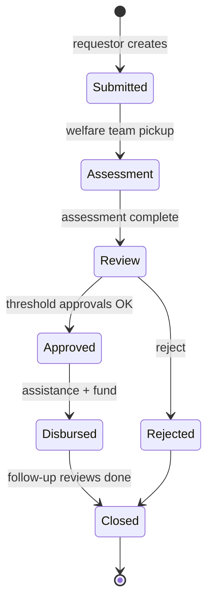

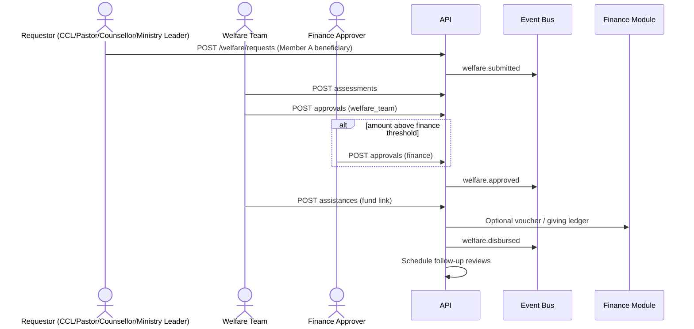

**SoD:** Creator of expense/voucher ≠ final finance approver above threshold (FR-FIN-006).

---

## 4. Marriage banns

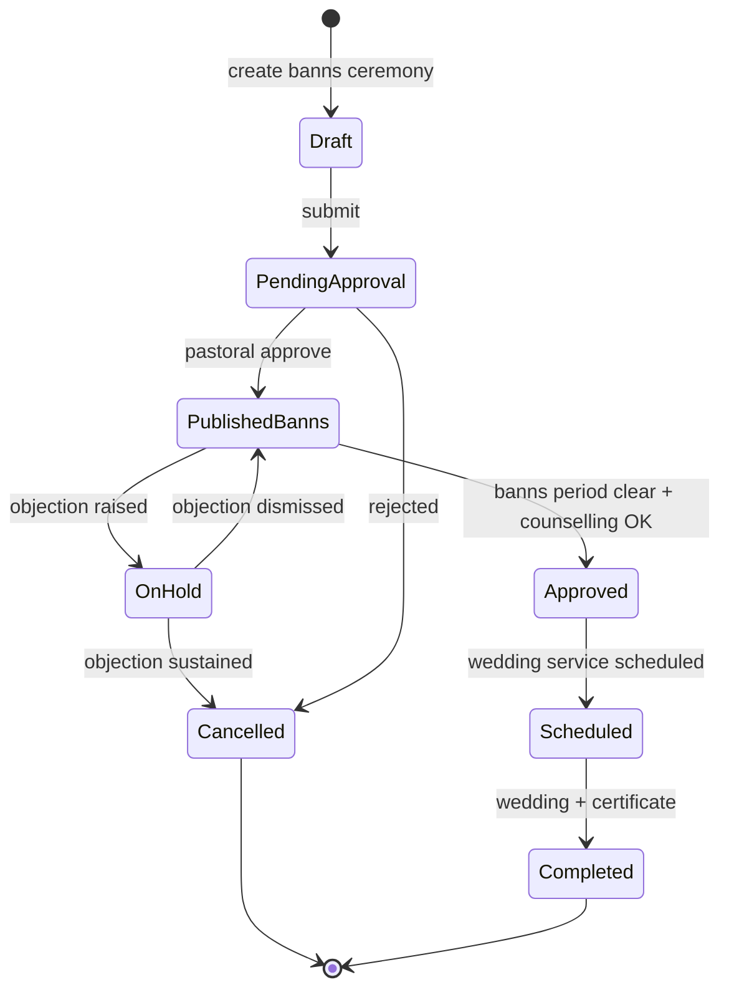

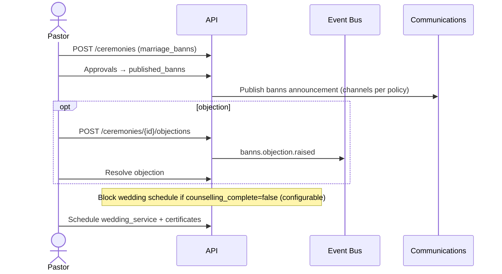

---

## 5. Roster publish

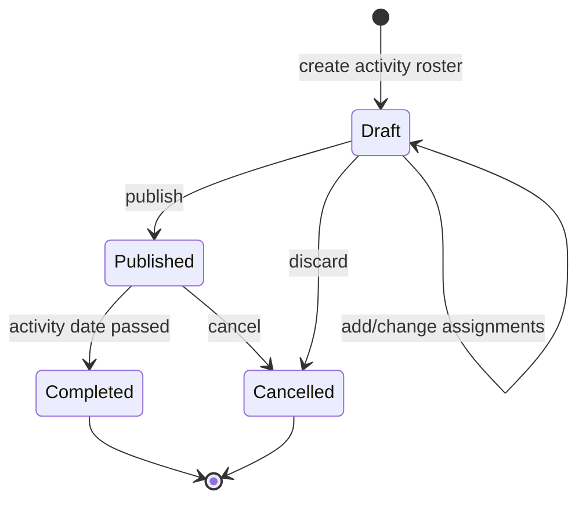

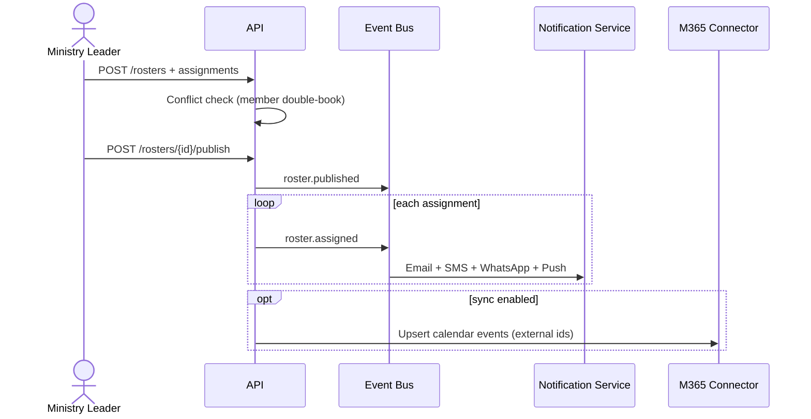

---

## 6. Automation rules catalogue

Channels: E=Email, S=SMS, W=WhatsApp, P=Push, O=Portal.  
SLA clocks use campus timezone unless noted.

| Rule ID | Trigger | Conditions | Actions | Channels | SLA |
|---|---|---|---|---|---|
| `AUTO-VIS-001` | `visitor.created` | Always | Create followups Day 1/3/7/14/30; assign default owner | E/W/P | Tasks created &lt; 1 min |
| `AUTO-VIS-010` | Day 1 due window | status=pending | Notify assignee | E/W/P | Notify T-4h and at due |
| `AUTO-VIS-011` | Day 3 due window | status=pending | Notify assignee | E/W/P | Notify T-4h and at due |
| `AUTO-VIS-012` | Day 7 due window | status=pending | Notify assignee + suggest channel (AI optional) | E/W/P | Notify T-4h and at due |
| `AUTO-VIS-013` | Day 14 due window | status=pending | Notify assignee | E/W/P/S | Notify T-8h and at due |
| `AUTO-VIS-014` | Day 30 due window | status=pending | Notify assignee; flag conversion review | E/W/P | Notify T-8h and at due |
| `AUTO-VIS-020` | Follow-up overdue | pending & now &gt; due_at + grace | Set escalated; notify Pastor | P/S/W | Grace 24h (config) |
| `AUTO-VIS-030` | `visitor.converted` | Always | Cancel remaining pending followups; notify care cell | E/W/P | &lt; 1 min |
| `AUTO-MEM-001` | `member.created` + care_cell set | Always | Notify Care Cell Leader | E/W/P | &lt; 5 min |
| `AUTO-MEM-010` | Status → Deceased | Always | Suppress automated COM (except pastoral) | — | Immediate |
| `AUTO-COUN-001` | Case risk → High | risk_level=high | Notify supervisor/Senior Pastor; tighten follow-up | P/S/W | &lt; 5 min |
| `AUTO-COUN-010` | Session next_followup_at due | case open/active | Reminder to counsellor (no note body) | E/P | T-24h, T-2h |
| `AUTO-PRAY-001` | Prayer urgency=Emergency OR escalate | Always | Escalate Pastor → Senior Pastor | P/S/W | Immediate (&lt; 2 min) |
| `AUTO-PRAY-010` | Confidential prayer | is_confidential | Suppress public walls; team-only notify | E/P | On assign |
| `AUTO-WEL-001` | `welfare.submitted` | Always | Notify Welfare Team queue | E/P/W | &lt; 5 min |
| `AUTO-WEL-010` | Approval pending | awaiting level | Remind approver | E/P | 24h then daily |
| `AUTO-WEL-020` | `welfare.approved` | Always | Notify requestor; prompt disbursement | E/P/W | &lt; 5 min |
| `AUTO-WEL-030` | `welfare.disbursed` | Always | Schedule follow-up reviews | E/P | Per tenant interval |
| `AUTO-CER-001` | Dedication/ceremony pending | Awaiting elder/pastor | Remind approvers | E/P | 48h cadence |
| `AUTO-CER-010` | Banns published | No open objections | Allow wedding schedule when counselling OK | — | On period end job |
| `AUTO-CER-020` | Objection raised | status open | Notify pastoral review board | E/P/W | &lt; 15 min |
| `AUTO-SLOT-001` | Agenda published | Slot items exist | Notify item owners | E/W/P | &lt; 5 min |
| `AUTO-ROST-001` | `roster.assigned` | Always | Multi-channel notify assignee | E/S/W/P | &lt; 5 min |
| `AUTO-ROST-010` | `roster.published` | Always | Bulk notify; optional M365 sync | E/S/W/P | &lt; 10 min |
| `AUTO-ROST-020` | Assignment reminder | activity starts_at − N | Reminder | E/W/P | T-48h, T-3h |
| `AUTO-FIN-001` | `giving.received` | Tally enabled | Enqueue tally receipt voucher | — | Sync SLA 15 min |
| `AUTO-FIN-010` | `tally.sync.failed` | attempts exhausted | Dead-letter + notify Finance | E/P | Immediate |
| `AUTO-FIN-020` | Expense pending approval | amount ≥ threshold | Notify finance.approve role | E/P | &lt; 5 min |
| `AUTO-COM-001` | Scheduled communication due | status=scheduled | Send; write deliveries | channel mix | On schedule ±1 min |
| `AUTO-AI-001` | Recommendation created | feature flag on | Inbox notify actor | P/O | Advisory only |

---

## 7. Day 1 / 3 / 7 / 14 / 30 visitor rules (detail)

| Day | Rule ID | Default owner | Required outcome on complete | Escalation if overdue |
|---|---|---|---|---|
| **1** | `AUTO-VIS-010` | Care Cell Leader or Visitor Team | Contacted / No Answer / Rescheduled / Declined / Escalated | Pastor after grace |
| **3** | `AUTO-VIS-011` | Same | Same + encourage second touch | Pastor |
| **7** | `AUTO-VIS-012` | Same | Engaged check; invite care cell/event | Pastor |
| **14** | `AUTO-VIS-013` | Same | Class invite consideration | Pastor + Associate CCL |
| **30** | `AUTO-VIS-014` | Same | Convert / continue / LostClosed decision | Pastor mandatory review |

**Common conditions**

- Skip remaining tasks if stage ∈ {Converted, LostClosed}.
- Do not SMS confidential prayer content.
- Quiet hours: queue until campus local window.
- Idempotent task creation: unique `(visitor_id, day_offset)`.

---

## 8. Escalation rules — high-risk counselling & emergency prayer

### 8.1 High-risk counselling (`AUTO-COUN-001`)

| Field | Value |
|---|---|
| Trigger | `risk_level` set/changed to `high`, or AI risk suggestion **accepted** by counsellor |
| Immediate actions | Notify `supervisor_user_id` and Senior Pastor role; set `high_risk_notified_at`; create follow-up SLA task (default 48h) |
| Channels | Push + SMS + WhatsApp (alert template **without** session summary) |
| Access | Session ciphertext still restricted to `counselling.notes.read` |
| SLA | Alert &lt; 5 minutes; acknowledgement required in UI within 2 hours (config) |
| Audit | Log action codes only; never note body |

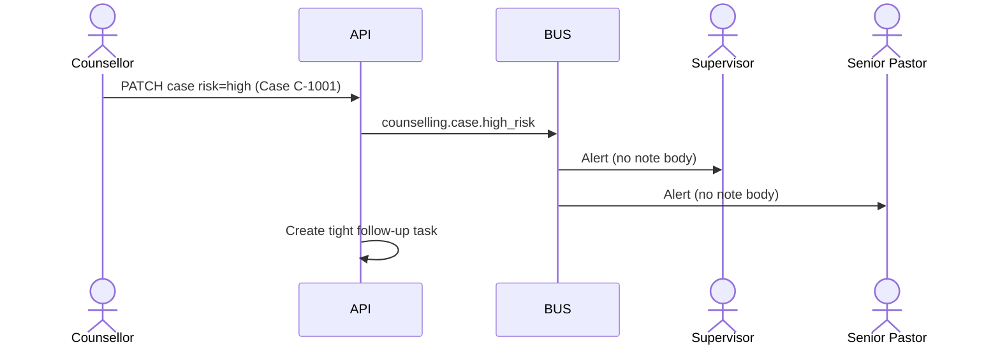

### 8.2 Emergency prayer (`AUTO-PRAY-001`)

| Field | Value |
|---|---|
| Trigger | `urgency=emergency` on create **or** `POST .../escalate` |
| Path | Prayer Team → Pastor → Senior Pastor (ack chain) |
| Channels | Push + SMS + WhatsApp immediately; Email follow-up |
| Confidential | If `is_confidential`, SMS/WhatsApp use generic “Emergency prayer — open app”; body only in portal for authorized |
| SLA | First pastoral ack &lt; 15 minutes (KPI) |
| Audit | Escalation actor, timestamps, targets |

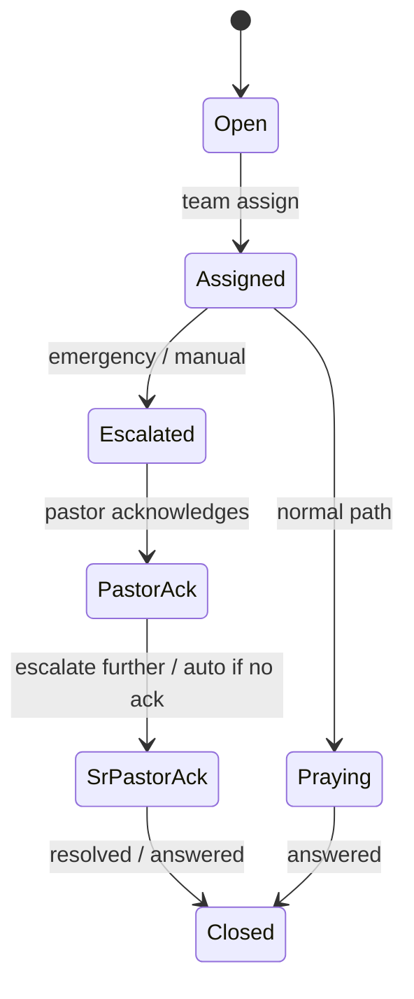

---

## 9. Operational notes

- Workflow engine is the system of record for task due dates; APIs mutate state; events fan out notifications.
- All automations are tenant-configurable (enable/disable, grace periods, thresholds) via `tenants.settings` / rules tables.
- AI rules never auto-approve welfare above threshold or auto-send pastoral content (FR-GLO-005, FR-AI-005).
- Failed notification attempts retry with backoff; permanent failures mark `suppressed`/`failed` without leaking content to logs.

---

## 10. Document control

| Version | Date | Change |
|---|---|---|
| 1.0 | 2026-08-23 | Workflow diagrams + automation catalogue |
