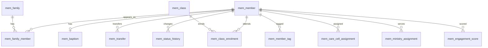
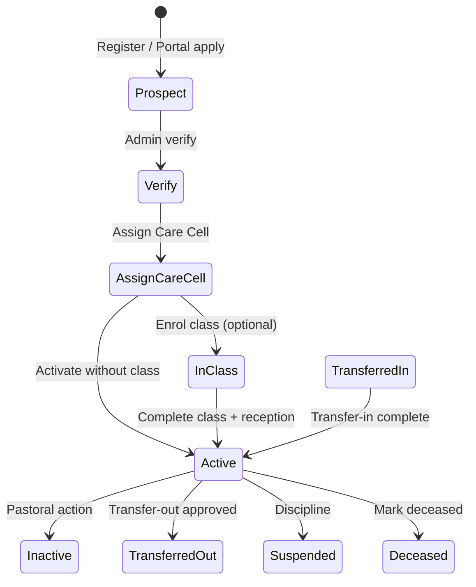
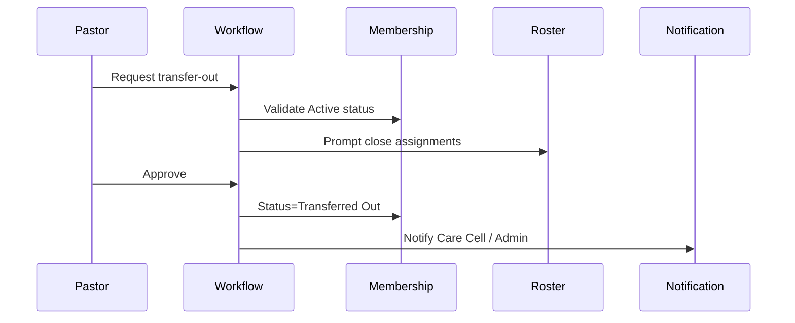

# M01 — Membership Management

| Field | Value |
|---|---|
| **Module code** | `MEM` |
| **FRS** | FR-MEM-* |
| **Epic** | EPIC-01 |
| **Overview** | [04-MODULE-DESIGN](../04-MODULE-DESIGN.md) |

---

## 1. Purpose

Provide the **system of record** for members and families: registration, lifecycle status, baptism, transfer, membership classes, classification tags, Care Cell / ministry / skills assignment, and engagement scoring—across multi-campus tenants.

---

## 2. Features

- Member registration with generated **Membership ID** and optional **Family ID**
- Family management: spouse link, unlimited children, shared household view
- Lifecycle statuses: Prospect, In Class, Active, Inactive, Transferred Out, Transferred In, Suspended, Deceased
- Baptism tracking (date, campus, officiant, certificate)
- Transfer in/out with source/destination and effective date
- Membership classes: enrolment, attendance, completion → reception eligibility
- Links to marriage records and baby dedications (CER)
- Multi-select **Member Classification** tags (youth, senior, new believer, etc.)
- Care Cell, ministries, skills, talents
- Profile photo and documents (object storage)
- Portal self-registration with admin verification
- AI: growth analysis, churn/attendance risk, ministry suitability, **engagement score**
- Church function participation history (Phase 2)

---

## 3. User Stories

| ID | Summary |
|---|---|
| [US-01-001](../05-USER-STORIES.md#us-01-001--register-member) | Register member with Membership ID |
| [US-01-002](../05-USER-STORIES.md#us-01-002--family-management) | Family management (spouse/children) |
| [US-01-003](../05-USER-STORIES.md#us-01-003--status-transitions) | Controlled status transitions |
| [US-01-004](../05-USER-STORIES.md#us-01-004--baptism-tracking) | Baptism tracking |
| [US-01-005](../05-USER-STORIES.md#us-01-005--membership-transfer) | Transfer in/out |
| [US-01-006](../05-USER-STORIES.md#us-01-006--membership-classes) | Membership classes |
| [US-01-007](../05-USER-STORIES.md#us-01-007--member-classification-tags) | Classification tags |
| [US-01-009](../05-USER-STORIES.md#us-01-009--ai-engagement-score) | AI engagement score |
| [US-01-010](../05-USER-STORIES.md#us-01-010--ai-ministry-suitability) | AI ministry suitability |
| [US-01-011](../05-USER-STORIES.md#us-01-011--new-member-notification) | Care Cell assignment notify |
| [US-01-012](../05-USER-STORIES.md#us-01-012--portal-self-registration) | Portal self-registration |

---

## 4. Database Tables

| Table | Purpose |
|---|---|
| `mem_member` | Core member profile and status |
| `mem_family` | Family unit (shared Family ID) |
| `mem_family_member` | Membership of person in family + relationship |
| `mem_status_history` | Auditable status transitions |
| `mem_baptism` | Baptism sacramental record |
| `mem_transfer` | Transfer-in / transfer-out requests |
| `mem_class` | Membership class definition |
| `mem_class_enrolment` | Enrolment + attendance + completion |
| `mem_classification_tag` | Tenant tag dictionary |
| `mem_member_tag` | Member ↔ tag |
| `mem_care_cell_assignment` | Care Cell membership history |
| `mem_ministry_assignment` | Ministry participation |
| `mem_skill` | Skills/talents dictionary + member links |
| `mem_engagement_score` | Latest/historical engagement scores |
| `mem_document` | Metadata for photos/documents (blob in File service) |
| `mem_function_participation` | Optional church function history |

---

## 5. Fields

### `mem_member` (key)

| Field | Notes |
|---|---|
| `id`, `tenant_id`, `campus_id` | Scope |
| `membership_id` | Unique per tenant; configurable format |
| `family_id` | FK nullable |
| `full_name`, `email`, `mobile`, `dob`, `gender`, `marital_status` | Profile |
| `address_json`, `profession` | Structured address preferred |
| `status` | Lifecycle enum |
| `photo_file_id` | File service ref |
| `engagement_score`, `engagement_updated_at` | Cached score |
| `consent_com`, `preferred_channels` | COM prefs |
| `created_at`, `updated_at`, `deleted_at` | Soft-delete |

### `mem_baptism`

`member_id`, `baptism_date`, `campus_id`, `officiant_user_id`, `certificate_file_id`, `ceremony_id` (CER link)

### `mem_transfer`

`direction` (IN/OUT), `member_id`, `source_church`, `destination_church`, `source_campus_id`, `destination_campus_id`, `effective_date`, `status`, `reason`, `approver_id`

### `mem_class_enrolment`

`class_id`, `member_id`, `enrolled_at`, `attendance_count`, `completed_at`, `eligible_for_reception`

### `mem_engagement_score`

`member_id`, `score`, `factors_json`, `model_version`, `computed_at`

---

## 6. Relationships

- CER marriage/dedication link via `member_id` / `family_id`
- VIS conversion creates/links `mem_member`
- ROST/COM/FIN reference `member_id`

---

## 7. APIs

| Method | Path | Summary |
|---|---|---|
| `POST` | `/api/v1/members` | Register member |
| `GET` | `/api/v1/members` | Search/list (campus, status, cell, tags) |
| `GET` | `/api/v1/members/{id}` | Profile detail |
| `PATCH` | `/api/v1/members/{id}` | Update profile |
| `POST` | `/api/v1/members/{id}/status` | Transition status |
| `POST` | `/api/v1/families` | Create family |
| `POST` | `/api/v1/families/{id}/members` | Link spouse/child |
| `POST` | `/api/v1/members/{id}/baptisms` | Record baptism |
| `POST` | `/api/v1/transfers` | Start transfer |
| `POST` | `/api/v1/transfers/{id}/approve` | Approve transfer |
| `GET/POST` | `/api/v1/classes` / `.../enrolments` | Classes |
| `GET` | `/api/v1/members/{id}/engagement-score` | Latest score |
| `POST` | `/api/v1/members/{id}/ai/ministry-suggestions` | AI suitability |
| `POST` | `/api/v1/portal/membership-applications` | Self-registration |

GraphQL: `member`, `members`, `family` queries with field-level ACL.

---

## 8. Workflows

### New member

### Transfer-out

---

## 9. Notifications

| Event | Recipients | Channels |
|---|---|---|
| New Care Cell assignment | Care Cell Leader | WhatsApp / Email / Push (prefs) |
| Status → Deceased | Stop marketing COM; pastoral only | Policy-driven |
| Transfer approved | Member (portal), Admin, Care Cell | Email / Push |
| Birthday / anniversary (optional) | Member | COM automation |
| Portal application submitted | Admin | Email / Push |

---

## 10. Reports

- Membership roll by campus / status / Care Cell
- New members by period
- Baptism register
- Transfer log
- Class completion / reception eligibility
- Classification segment counts
- Engagement score distribution (aggregates)

---

## 11. Dashboards

| Widget | Audience |
|---|---|
| Active members / net growth | Senior Pastor, Admin |
| Prospects & In Class funnel | Pastor, Ministry Leader |
| Care Cell size heatmap | Care Cell Leaders (scoped) |
| Engagement score risk list | Care Cell Leader |
| Transfer in/out trend | Admin |

---

## 12. AI Features

| Feature | Behavior |
|---|---|
| Membership growth analysis | Campus/period trends |
| Attendance / churn risk | Explainable signals; no auto-status change |
| Ministry suitability | Skills/talents/history → recommendations |
| Engagement score | Factor breakdown; accept/dismiss logged |

---

## 13. Security Controls

- RBAC on create/update/status/transfer
- MFA for Admin and pastoral privilege paths
- Field masking on list views (email/mobile partial)
- Document download ACL
- Audit all mutations and exports
- Soft-delete; erasure via retention workflow

---

## 14. Validation Rules

- Membership ID unique per tenant
- Email/mobile uniqueness: warn or block per tenant policy
- Status transitions must follow allowed matrix; reason required
- DOB cannot be future; baptism date ≥ DOB when both set
- Spouse link: at most one active spouse relationship
- Portal application requires campus; cannot self-activate to Active
- Classification tags from tenant dictionary only

---

## 15. Integration Requirements

| System | Need |
|---|---|
| File service | Photos, certificates, documents ≤50MB allowed types |
| Notification | Assignment and lifecycle events |
| Workflow | Transfer and self-registration verification |
| CER | Baptism / marriage / dedication bidirectional links |
| VIS | Convert visitor → member |
| COM | Segment by status, cell, tags; respect consent |
| M365 (optional) | Profile photo sync not required; SSO only |
| ANA | Member aggregates for dashboards |

---

## Document control

| Version | Date | Change |
|---|---|---|
| 1.0 | 2026-08-23 | Initial M01 design |
