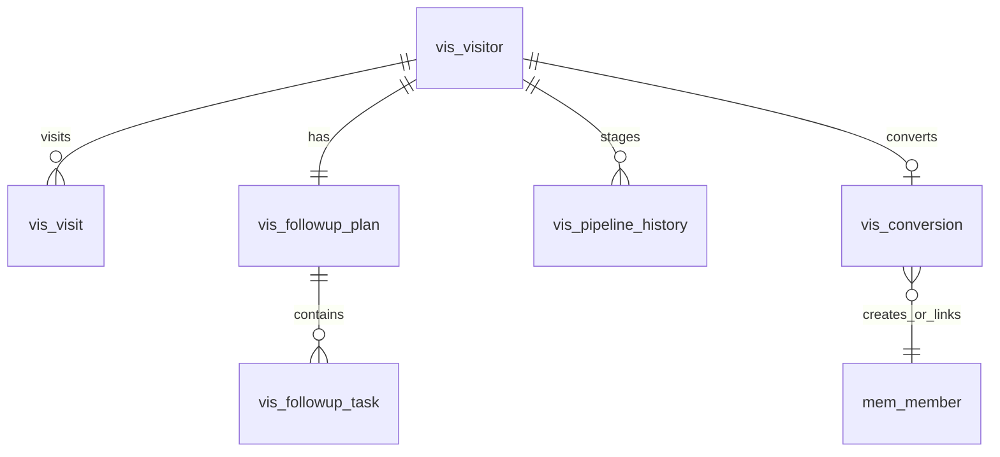
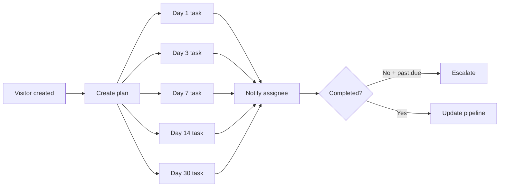

# M02 — Visitor Management

| Field | Value |
|---|---|
| **Module code** | `VIS` |
| **FRS** | FR-VIS-* |
| **Epic** | EPIC-02 |
| **Overview** | [04-MODULE-DESIGN](../04-MODULE-DESIGN.md) |

---

## 1. Purpose

Capture visitors, attribute **exact acquisition sources**, drive mandatory **Day 1 / 3 / 7 / 14 / 30** follow-ups, manage the conversion pipeline, and convert visitors to members with full audit trail.

---

## 2. Features

- Visitor registration with contact, campus, service, interests, prayer-needs flag
- **Visitor Source** exact enum (see §5)
- Referrer capture for person-based sources
- Duplicate detection / merge suggestions
- Pipeline: New → Contacted → Engaged → Class Invited → Converted → Lost/Closed
- Auto follow-up tasks Day **1, 3, 7, 14, 30** from first visit
- Outcome logging, overdue escalation
- One-click convert → MEM
- Analytics by source, campus, conversion rate, time-to-convert
- AI: engagement score, conversion probability, follow-up recommendations, pastoral escalation
- WhatsApp template follow-ups

---

## 3. User Stories

| ID | Summary |
|---|---|
| [US-02-001](../05-USER-STORIES.md#us-02-001--register-visitor-with-source-enum) | Register with exact source enum |
| [US-02-002](../05-USER-STORIES.md#us-02-002--auto-follow-up-plan) | Auto Day 1/3/7/14/30 tasks |
| [US-02-003](../05-USER-STORIES.md#us-02-003--complete-follow-up-task) | Complete follow-up with outcome |
| [US-02-004](../05-USER-STORIES.md#us-02-004--conversion-to-member) | Convert to member |
| [US-02-005](../05-USER-STORIES.md#us-02-005--visitor-analytics) | Source/campus analytics |
| [US-02-006](../05-USER-STORIES.md#us-02-006--duplicate-detection) | Duplicate detection |
| [US-02-007](../05-USER-STORIES.md#us-02-007--ai-engagement--conversion-assist) | AI engagement & conversion |
| [US-02-008](../05-USER-STORIES.md#us-02-008--pastoral-escalation) | Pastoral escalation |
| [US-02-009](../05-USER-STORIES.md#us-02-009--pipeline-kanban) | Pipeline Kanban |
| [US-02-010](../05-USER-STORIES.md#us-02-010--whatsapp-follow-up-template) | WhatsApp templates |

---

## 4. Database Tables

| Table | Purpose |
|---|---|
| `vis_visitor` | Visitor profile + pipeline stage |
| `vis_visit` | Individual visit occurrences |
| `vis_followup_plan` | Plan instance tied to first visit |
| `vis_followup_task` | Day-N tasks with due/outcome |
| `vis_pipeline_history` | Stage change audit |
| `vis_conversion` | Link visitor → member |
| `vis_duplicate_candidate` | Suggested merges |
| `vis_engagement_score` | AI scores history |

---

## 5. Fields

### Visitor Source (exact enum)

`Friend`, `Church Member`, `Family Member`, `Care Cell Member`, `Pastor`, `Ministry Leader`, `Church Event`, `Outreach Program`, `Website`, `Facebook`, `Instagram`, `YouTube`, `WhatsApp`, `Google Search`, `Walk-In`, `Advertisement`, `Other`

**Referrer required when source ∈** Friend, Church Member, Family Member, Care Cell Member, Pastor, Ministry Leader.

### `vis_visitor` (key)

| Field | Notes |
|---|---|
| `id`, `tenant_id`, `campus_id` | Scope |
| `full_name`, `email`, `mobile`, `dob` | Identity (no PII in logs) |
| `source`, `referrer_member_id` | Acquisition |
| `pipeline_stage` | Enum above |
| `first_visit_at`, `interests_json` | Context |
| `prayer_needs_flag` | Boolean only for analytics |
| `assignee_user_id` | Default Care Cell / Visitor Team |
| `converted_member_id` | Set on conversion |

### `vis_followup_task`

`plan_id`, `day_offset` (1|3|7|14|30), `due_at`, `assignee_id`, `status` (Open/Done/Overdue/Cancelled), `outcome_code`, `note` (ACL), `escalated_at`

---

## 6. Relationships



---

## 7. APIs

| Method | Path | Summary |
|---|---|---|
| `POST` | `/api/v1/visitors` | Register visitor (+ auto plan) |
| `GET` | `/api/v1/visitors` | List/filter/search |
| `GET/PATCH` | `/api/v1/visitors/{id}` | Detail / update |
| `POST` | `/api/v1/visitors/{id}/stage` | Move pipeline stage |
| `GET` | `/api/v1/visitors/{id}/followups` | List tasks |
| `POST` | `/api/v1/followups/{id}/complete` | Complete with outcome |
| `POST` | `/api/v1/visitors/{id}/convert` | Convert to member |
| `GET` | `/api/v1/visitors/analytics` | Source/conversion metrics |
| `GET` | `/api/v1/visitors/duplicates` | Merge candidates |
| `POST` | `/api/v1/visitors/merge` | Merge (admin) |
| `POST` | `/api/v1/visitors/{id}/ai/recommendations` | AI follow-up assist |

---

## 8. Workflows

### Follow-up schedule



### Conversion

```mermaid
sequenceDiagram
  participant Pastor
  participant VIS
  participant MEM
  participant WF
  Pastor->>VIS: Convert Visitor B
  VIS->>MEM: Create/link member
  VIS->>VIS: Stage=Converted; cancel open tasks
  VIS->>WF: Audit conversion
```

---

## 9. Notifications

| Event | Channels |
|---|---|
| Task created / due / overdue | Email, SMS, WhatsApp, Push |
| Pastoral escalation | Push / Email (no confidential prayer text on SMS) |
| Conversion complete | Care Cell Leader, Admin |

---

## 10. Reports

- Visitors by source (exact enum)
- Follow-up SLA adherence (Day 1/3/7/14/30)
- Conversion rate & median time-to-convert
- Pipeline stage snapshot
- Overdue task aging

---

## 11. Dashboards

| Widget | Audience |
|---|---|
| Pipeline Kanban | Ministry Leader, Care Cell |
| Source performance | Senior Pastor |
| Follow-up SLA % | Pastor |
| Hot leads (AI score) | Care Cell Leader |

---

## 12. AI Features

- Visitor Engagement Score
- Conversion Probability
- Follow-Up Recommendations (channel / timing)
- Pastoral Escalation when thresholds met  
All advisory; human sends messages.

---

## 13. Security Controls

- Campus-scoped lists for Volunteers
- Merge requires Admin
- Follow-up notes ACL; never in SMS body
- Consent/opt-in for WhatsApp templates
- Audit convert/merge/stage changes

---

## 14. Validation Rules

- Source must be from exact enum
- Referrer mandatory for person-based sources
- Exactly five default tasks at offsets 1/3/7/14/30 (templates may add extras; defaults remain)
- Completing task requires `outcome_code`
- Convert only from eligible stages; cannot convert Lost without reopen
- Duplicate merge preserves follow-up history

---

## 15. Integration Requirements

| System | Need |
|---|---|
| MEM | Conversion field mapping |
| Notification | Multi-channel task alerts |
| WhatsApp | Approved Day-N templates |
| Workflow | Escalation SLAs |
| COM | Optional class invite campaigns |
| ANA | Funnel & source dashboards |

---

## Document control

| Version | Date | Change |
|---|---|---|
| 1.0 | 2026-08-23 | Initial M02 design |
