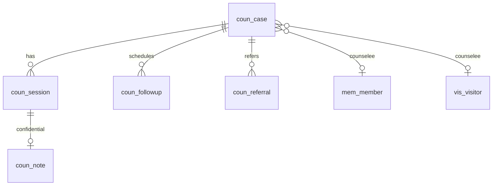
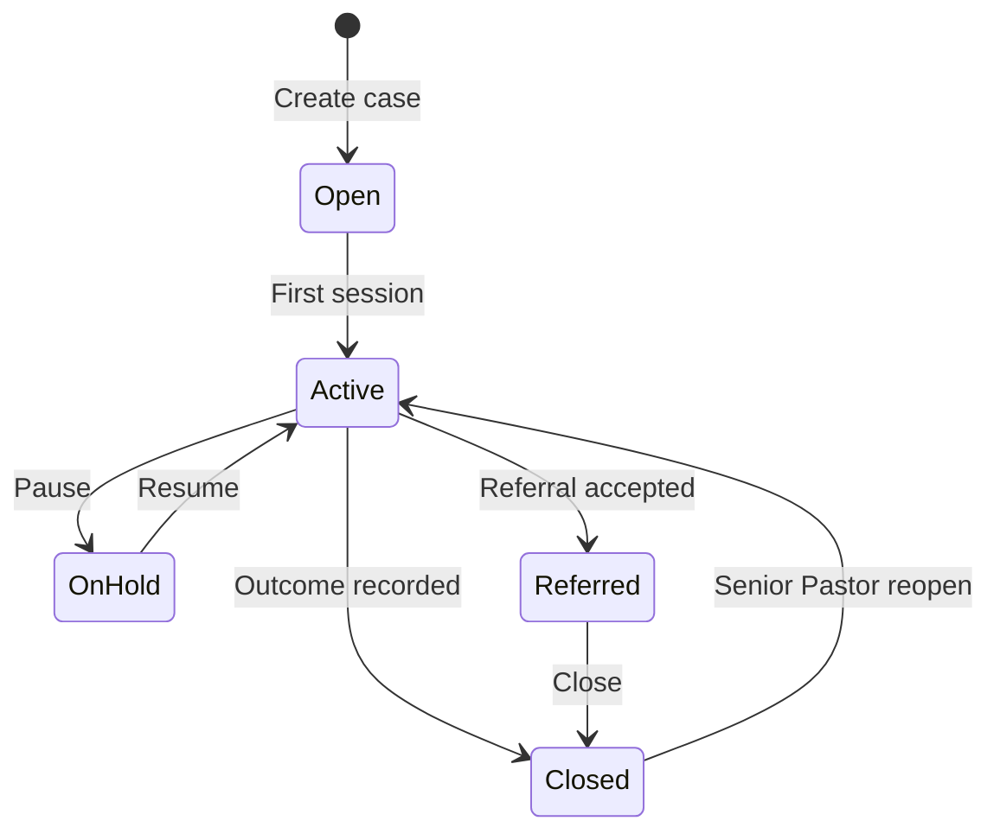
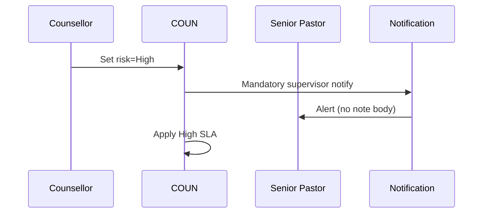

# M03 — Counselling Management

| Field | Value |
|---|---|
| **Module code** | `COUN` |
| **FRS** | FR-COUN-* |
| **Epic** | EPIC-03 |
| **Overview** | [04-MODULE-DESIGN](../04-MODULE-DESIGN.md) |

---

## 1. Purpose

Manage Christian counselling **cases and sessions** with fixed categories, risk levels **Low / Moderate / High**, confidential notes, referrals, and follow-ups—protecting pastoral confidentiality with field-level security.

---

## 2. Features

- Case open for member or visitor
- Categories: Marriage, Family, Youth, Addiction, Mental Health, Career, Grief, Trauma, Financial, Spiritual Care, Leadership Mentoring, Church Conflict
- Risk: **Low**, **Moderate**, **High** (High → supervisor notify + tighter SLA)
- Session schedule, attendance, duration, confidential summary
- Follow-up scheduling with non-sensitive reminders
- Referral management (internal pastor/elder or external agency flag)—not an EHR
- Case statuses: Open, Active, On Hold, Referred, Closed
- AI risk identification, referral suggestions, follow-up predictions
- Senior Pastor aggregate dashboard (no note text)

---

## 3. User Stories

| ID | Summary |
|---|---|
| [US-03-001](../05-USER-STORIES.md#us-03-001--open-case-with-category) | Open case with category |
| [US-03-002](../05-USER-STORIES.md#us-03-002--set-risk-level) | Set risk Low/Moderate/High |
| [US-03-003](../05-USER-STORIES.md#us-03-003--session-notes-confidentiality) | Confidential session notes |
| [US-03-004](../05-USER-STORIES.md#us-03-004--schedule-follow-up-session) | Schedule follow-up |
| [US-03-005](../05-USER-STORIES.md#us-03-005--referral-management) | Referrals |
| [US-03-006](../05-USER-STORIES.md#us-03-006--case-closure) | Case closure |
| [US-03-007](../05-USER-STORIES.md#us-03-007--ai-risk-suggestion) | AI risk suggestion |
| [US-03-008](../05-USER-STORIES.md#us-03-008--ai-referral-suggestions) | AI referral suggestions |
| [US-03-009](../05-USER-STORIES.md#us-03-009--counselling-dashboard-widget) | Aggregate dashboard |
| [US-03-010](../05-USER-STORIES.md#us-03-010--session-reminder-push) | Session reminder push |

---

## 4. Database Tables

| Table | Purpose |
|---|---|
| `coun_case` | Case header (category, risk, status, assignees) |
| `coun_session` | Session instances |
| `coun_note` | Encrypted confidential note bodies |
| `coun_followup` | Follow-up tasks |
| `coun_referral` | Internal/external referrals |
| `coun_case_access` | Explicit ACL grants (break-glass) |
| `coun_risk_history` | Risk changes + AI suggestions |

---

## 5. Fields

### Categories (exact)

`Marriage`, `Family`, `Youth`, `Addiction`, `Mental Health`, `Career`, `Grief`, `Trauma`, `Financial`, `Spiritual Care`, `Leadership Mentoring`, `Church Conflict`

### Risk (exact)

`Low` | `Moderate` | `High`

### `coun_case` (key)

`id`, `tenant_id`, `campus_id`, `counselee_member_id`, `counselee_visitor_id`, `category`, `risk_level`, `status`, `primary_counsellor_id`, `supervisor_id`, `opened_at`, `closed_at`, `outcome_code`

### `coun_note`

`session_id`, `ciphertext`, `key_ref`, `author_id`, `created_at` — readable only by assigned Counsellor + Senior Pastor (configurable)

### `coun_referral`

`case_id`, `type` (INTERNAL/EXTERNAL), `target_role_or_agency`, `status`, `notes_redacted_flag`

---

## 6. Relationships

---

## 7. APIs

| Method | Path | Summary |
|---|---|---|
| `POST` | `/api/v1/counselling/cases` | Open case |
| `GET` | `/api/v1/counselling/cases` | List (ACL filtered) |
| `GET/PATCH` | `/api/v1/counselling/cases/{id}` | Detail / update |
| `POST` | `/api/v1/counselling/cases/{id}/risk` | Set risk |
| `POST` | `/api/v1/counselling/cases/{id}/sessions` | Schedule session |
| `POST` | `/api/v1/counselling/sessions/{id}/notes` | Write confidential note |
| `GET` | `/api/v1/counselling/sessions/{id}/notes` | Read note (ACL) |
| `POST` | `/api/v1/counselling/cases/{id}/referrals` | Create referral |
| `POST` | `/api/v1/counselling/cases/{id}/close` | Close with outcome |
| `POST` | `/api/v1/counselling/cases/{id}/ai/risk` | AI risk suggestion |
| `GET` | `/api/v1/counselling/metrics` | Aggregates only |

---

## 8. Workflows

---

## 9. Notifications

| Event | Content rules | Channels |
|---|---|---|
| Session reminder | Time/location only | Push / Email |
| High risk set | Category + case id; **no note text** | Push / Email to Senior Pastor |
| Referral created | Non-sensitive | Email / Push |
| **Forbidden** | Confidential note content | SMS / WhatsApp |

---

## 10. Reports

- Open cases by category / risk (aggregates)
- Counsellor caseload
- Session volume / missed sessions
- Referral outcomes
- SLA adherence for High risk  
Exports exclude note bodies by default; elevated export + watermark + audit.

---

## 11. Dashboards

| Widget | Audience |
|---|---|
| Open by risk (counts) | Senior Pastor |
| My caseload | Counsellor |
| High-risk aging | Senior Pastor |
| Category mix | Pastor (aggregate) |

---

## 12. AI Features

- Risk Identification suggestions (confirm to apply)
- Referral Suggestions
- Follow-Up Predictions  
Context scrubbing; never train on note text without contract.

---

## 13. Security Controls

- Field-level ACL on notes
- Encryption at rest for note ciphertext
- Break-glass dual-control or full justification + audit
- List/mask counselee identifiers for unauthorized roles
- MFA for Counsellor and Senior Pastor
- Immutable audit on note read/export

---

## 14. Validation Rules

- Exactly one of member or visitor counselee required
- Category and risk from fixed enums only
- High risk requires supervisor notification path configured
- Close requires `outcome_code`
- Notes cannot be patched into notification templates
- Reopen Closed: Senior Pastor only (configurable)

---

## 15. Integration Requirements

| System | Need |
|---|---|
| MEM / VIS | Counselee link |
| Notification | Non-sensitive reminders only |
| Calendar / M365 (optional) | Session holds without note body |
| ROST | Counselling duty slots may link case id carefully |
| ANA | Aggregates only; FR-ANA-011 |
| Audit | All note access |

---

## Document control

| Version | Date | Change |
|---|---|---|
| 1.0 | 2026-08-23 | Initial M03 design |
