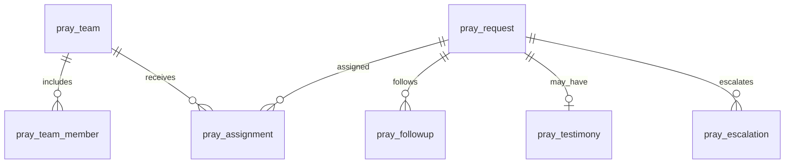
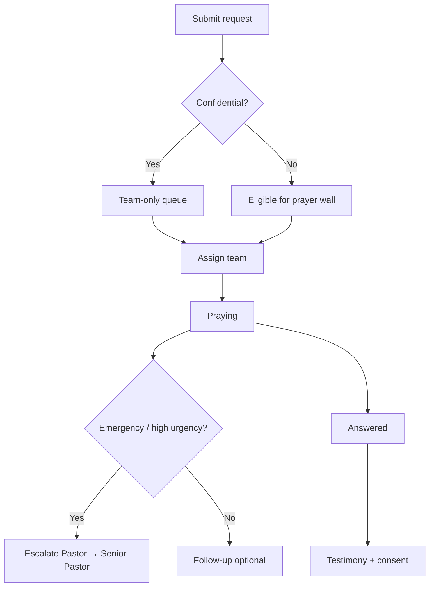

# M04 — Prayer Support Management

| Field | Value |
|---|---|
| **Module code** | `PRAY` |
| **FRS** | FR-PRAY-* |
| **Epic** | EPIC-04 |
| **Overview** | [04-MODULE-DESIGN](../04-MODULE-DESIGN.md) |

---

## 1. Purpose

Capture and steward prayer requests across categories, assign **prayer teams**, escalate emergencies, record **testimonies**, and assist pastors with **AI prayer drafts and scripture suggestions**—with confidentiality controls.

---

## 2. Features

- Submit request (member / visitor / anonymous-to-team per policy)
- Categories: Spiritual Growth, Healing, Family, Financial, Career, Education, Emotional Support, Church Growth, Ministry, Emergency, Special Needs
- Confidentiality flag; urgency levels
- Prayer team assignment, prayed status, follow-up
- Escalation: Team → Pastor → Senior Pastor for Emergency / high urgency
- Testimonies linked to answered requests (publish consent)
- Public prayer wall excludes confidential items
- AI: prayer generation, scripture suggestions, prayer points, follow-up recommendations
- Mobile submit; WhatsApp acknowledge templates

---

## 3. User Stories

| ID | Summary |
|---|---|
| [US-04-001](../05-USER-STORIES.md#us-04-001--submit-categorized-prayer) | Submit categorized prayer |
| [US-04-002](../05-USER-STORIES.md#us-04-002--assign-prayer-team) | Assign prayer team |
| [US-04-003](../05-USER-STORIES.md#us-04-003--emergency-escalation) | Emergency escalation |
| [US-04-004](../05-USER-STORIES.md#us-04-004--confidential-prayer-wall-exclusion) | Confidential wall exclusion |
| [US-04-005](../05-USER-STORIES.md#us-04-005--record-testimony) | Record testimony |
| [US-04-006](../05-USER-STORIES.md#us-04-006--ai-scripture--prayer-draft) | AI scripture & prayer draft |
| [US-04-007](../05-USER-STORIES.md#us-04-007--follow-up-on-prayer) | Follow-up tasks |
| [US-04-008](../05-USER-STORIES.md#us-04-008--prayer-analytics) | Category analytics |
| [US-04-009](../05-USER-STORIES.md#us-04-009--mobile-prayer-submit) | Mobile submit |
| [US-04-010](../05-USER-STORIES.md#us-04-010--integration-whatsapp-prayer-acknowledge) | WhatsApp ack |

---

## 4. Database Tables

| Table | Purpose |
|---|---|
| `pray_request` | Prayer request header + body (ACL) |
| `pray_team` | Team definition |
| `pray_team_member` | Team roster |
| `pray_assignment` | Request ↔ team / person |
| `pray_status_event` | Prayed / answered / closed events |
| `pray_followup` | Follow-up tasks |
| `pray_testimony` | Testimony + publish consent |
| `pray_escalation` | Escalation trail |
| `pray_ai_draft` | Stored AI drafts pending approval |

---

## 5. Fields

### Categories (exact)

`Spiritual Growth`, `Healing`, `Family`, `Financial`, `Career`, `Education`, `Emotional Support`, `Church Growth`, `Ministry`, `Emergency`, `Special Needs`

### `pray_request` (key)

`id`, `tenant_id`, `campus_id`, `requester_member_id`, `requester_visitor_id`, `anonymous_flag`, `category`, `urgency`, `confidential_flag`, `body` (ACL), `status` (Open/Assigned/Praying/Answered/Closed), `created_at`

### `pray_testimony`

`request_id`, `body`, `publish_consent`, `published_at`, `com_campaign_id` optional

---

## 6. Relationships

---

## 7. APIs

| Method | Path | Summary |
|---|---|---|
| `POST` | `/api/v1/prayer/requests` | Submit request |
| `GET` | `/api/v1/prayer/requests` | List (wall vs team views) |
| `POST` | `/api/v1/prayer/requests/{id}/assign` | Assign team |
| `POST` | `/api/v1/prayer/requests/{id}/escalate` | Escalate |
| `POST` | `/api/v1/prayer/requests/{id}/status` | Update status |
| `POST` | `/api/v1/prayer/requests/{id}/testimonies` | Add testimony |
| `POST` | `/api/v1/prayer/requests/{id}/ai/draft` | Generate prayer/scripture draft |
| `POST` | `/api/v1/prayer/ai/drafts/{id}/approve` | Approve before share |
| `GET` | `/api/v1/prayer/analytics` | Category aggregates |

---

## 8. Workflows

---

## 9. Notifications

| Event | Channels |
|---|---|
| Assigned to team | Push / Email / WhatsApp (template) |
| Emergency escalation | Immediate Push / SMS / WhatsApp; quiet-hours override with confirm; ack required |
| Team response to requester | Non-sensitive ack only |
| Testimony published | Optional COM |

---

## 10. Reports

- Volume by category / campus (no request text)
- Emergency response times
- Team load balance
- Testimony publish rates
- Confidential vs public mix

---

## 11. Dashboards

| Widget | Audience |
|---|---|
| Open requests by category | Senior Pastor |
| Emergency queue | Pastor / Team Lead |
| My team queue | Prayer Team |
| Testimony highlights | Portal (consented) |

---

## 12. AI Features

- Prayer Generation (draft; human edit before share)
- Scripture Suggestions
- Prayer Points extraction
- Follow-Up Recommendations  
Safety: block auto-send without approval.

---

## 13. Security Controls

- Confidential requests excluded from public APIs/walls/exports by default
- Team-only ACL; escalate expands visibility per policy
- Template variables limited (no full body on SMS)
- Audit assign/escalate/publish

---

## 14. Validation Rules

- Category from fixed enum
- Emergency requires escalation path
- Testimony publish requires explicit consent
- Anonymous-to-team still creates audit actor (system/portal)
- AI draft cannot mark request Answered automatically

---

## 15. Integration Requirements

| System | Need |
|---|---|
| MEM / VIS | Requester link |
| Notification + WhatsApp | Assign / escalate / ack templates |
| COM | Optional testimony share |
| ANA | Category trends without bodies |
| AI Copilot | Draft generation with scrubbing |

---

## Document control

| Version | Date | Change |
|---|---|---|
| 1.0 | 2026-08-23 | Initial M04 design |
