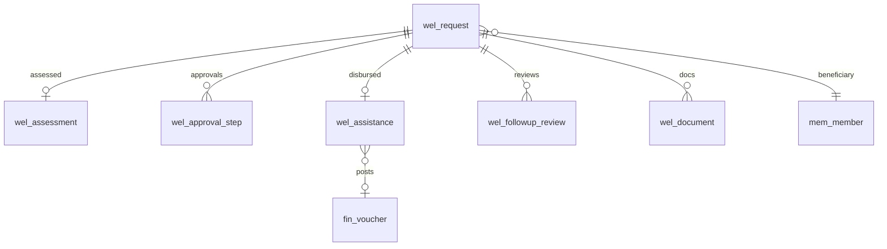
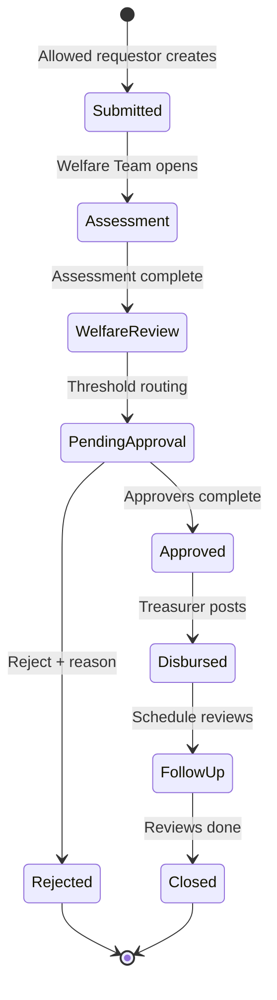

# M05 — Welfare Management

| Field | Value |
|---|---|
| **Module code** | `WEL` |
| **FRS** | FR-WEL-* |
| **Epic** | EPIC-05 |
| **Overview** | [04-MODULE-DESIGN](../04-MODULE-DESIGN.md) |

---

## 1. Purpose

Run a fair, auditable welfare process: **request → assess → approve → disburse → follow-up review**, restricted to authorized requestors, with AI eligibility assist and Finance fund linkage.

---

## 2. Features

- Requestors only: **Care Cell Leader**, **Associate Care Cell Leader**, **Counsellor**, **Ministry Leader**, **Pastor**
- Request linked to beneficiary (Member A), need type, amount/currency, narrative, supporting docs
- Case assessment: household, income indicators, prior aid history
- Approval workflow with threshold matrix and segregation of duties
- Assistance / disbursement linked to Welfare Fund (FIN)
- Post-assistance follow-up reviews
- AI: eligibility score, risk/fraud-dependency signals, funding impact, approval recommendations (never auto-approve above threshold)
- History on member profile (ACL)
- Feeds WCE for comparison

---

## 3. User Stories

| ID | Summary |
|---|---|
| [US-05-001](../05-USER-STORIES.md#us-05-001--create-welfare-request-allowed-roles) | Create request (allowed roles) |
| [US-05-002](../05-USER-STORIES.md#us-05-002--case-assessment) | Case assessment |
| [US-05-003](../05-USER-STORIES.md#us-05-003--multi-level-approval) | Multi-level approval |
| [US-05-004](../05-USER-STORIES.md#us-05-004--disburse-assistance) | Disburse assistance |
| [US-05-005](../05-USER-STORIES.md#us-05-005--follow-up-review) | Follow-up review |
| [US-05-006](../05-USER-STORIES.md#us-05-006--ai-eligibility-score) | AI eligibility score |
| [US-05-007](../05-USER-STORIES.md#us-05-007--notifications-on-state-change) | State-change notifications |
| [US-05-008](../05-USER-STORIES.md#us-05-008--welfare-history-on-member) | Member welfare history |
| [US-05-009](../05-USER-STORIES.md#us-05-009--document-pack-upload) | Document pack ≤50MB |
| [US-05-010](../05-USER-STORIES.md#us-05-010--finance-anomaly-on-welfare-pay) | Duplicate payment detection |

---

## 4. Database Tables

| Table | Purpose |
|---|---|
| `wel_request` | Welfare request header |
| `wel_assessment` | Structured assessment |
| `wel_approval_step` | Workflow steps / decisions |
| `wel_assistance` | Disbursement record |
| `wel_followup_review` | Post-aid reviews |
| `wel_document` | Supporting file metadata |
| `wel_ai_score` | Eligibility/risk scores |
| `wel_threshold_policy` | Amount → approver matrix |

---

## 5. Fields

### `wel_request` (key)

`id`, `tenant_id`, `campus_id`, `beneficiary_member_id`, `requestor_user_id`, `requestor_role`, `need_type`, `amount`, `currency_code`, `narrative` (ACL), `status` (Submitted / Assessment / Review / PendingApproval / Approved / Rejected / Disbursed / Closed), `created_at`

### `wel_assessment`

`request_id`, `household_size`, `income_band`, `prior_aid_summary`, `checklist_json`, `assessor_id`, `completed_at`

### `wel_assistance`

`request_id`, `fund_id` (FIN), `method`, `amount`, `currency_code`, `voucher_id`, `disbursed_at`, `disbursed_by`

---

## 6. Relationships

---

## 7. APIs

| Method | Path | Summary |
|---|---|---|
| `POST` | `/api/v1/welfare/requests` | Create (role-gated) |
| `GET` | `/api/v1/welfare/requests` | List/filter |
| `POST` | `/api/v1/welfare/requests/{id}/assessment` | Save assessment |
| `POST` | `/api/v1/welfare/requests/{id}/submit-review` | Advance to review |
| `POST` | `/api/v1/welfare/requests/{id}/approve` | Approve / reject step |
| `POST` | `/api/v1/welfare/requests/{id}/disburse` | Record assistance |
| `POST` | `/api/v1/welfare/requests/{id}/followups` | Schedule review |
| `GET` | `/api/v1/members/{id}/welfare-history` | ACL history |
| `POST` | `/api/v1/welfare/requests/{id}/ai/eligibility` | AI scores |
| `POST` | `/api/v1/welfare/documents` | Upload docs |

---

## 8. Workflows

---

## 9. Notifications

| Event | Recipients | Rules |
|---|---|---|
| State change | Requestor, approvers | Email / Push / WhatsApp |
| Approval needed | Role from matrix | Deep link |
| Disbursed | Beneficiary (non-sensitive) | No bank details on SMS |
| AI anomaly on pay | Finance Manager | Before final post |

---

## 10. Reports

- Requests by status / campus / need type
- Approval cycle time
- Disbursements by fund / currency
- Prior aid frequency (dependency signals)
- Reject reasons distribution

---

## 11. Dashboards

| Widget | Audience |
|---|---|
| Pipeline aging | Welfare Team |
| Pending my approval | Pastor / Finance |
| Fund utilization | Treasurer |
| AI eligibility triage queue | Welfare Team |

---

## 12. AI Features

- Eligibility Assessment (explainable)
- Risk Scoring (fraud / dependency)
- Funding Impact Analysis
- Approval Recommendations — **never auto-approve above threshold**

---

## 13. Security Controls

- Create gated by requestor role list
- Narrative field-level ACL
- SoD: requestor ≠ final approver for high tiers
- Document ACL limited to WEL roles
- Finance anomaly override requires reason + audit
- MFA for Finance / Pastoral approvers

---

## 14. Validation Rules

- Requestor role ∈ allowed set
- Amount & currency required; currency ∈ tenant FIN list
- Assessment checklist complete before Welfare Review
- Approve/reject requires reason on reject
- Disburse only from Approved; fund balance check
- Docs: type/size ≤50MB; virus scan hook

---

## 15. Integration Requirements

| System | Need |
|---|---|
| MEM | Beneficiary + history |
| FIN | Welfare Fund, vouchers, anomaly checks |
| WCE | Eligible assessed cases for comparison |
| File | Supporting documents |
| Workflow | Threshold matrix |
| Notification | State changes |
| ANA | Demand aggregates |

---

## Document control

| Version | Date | Change |
|---|---|---|
| 1.0 | 2026-08-23 | Initial M05 design |
