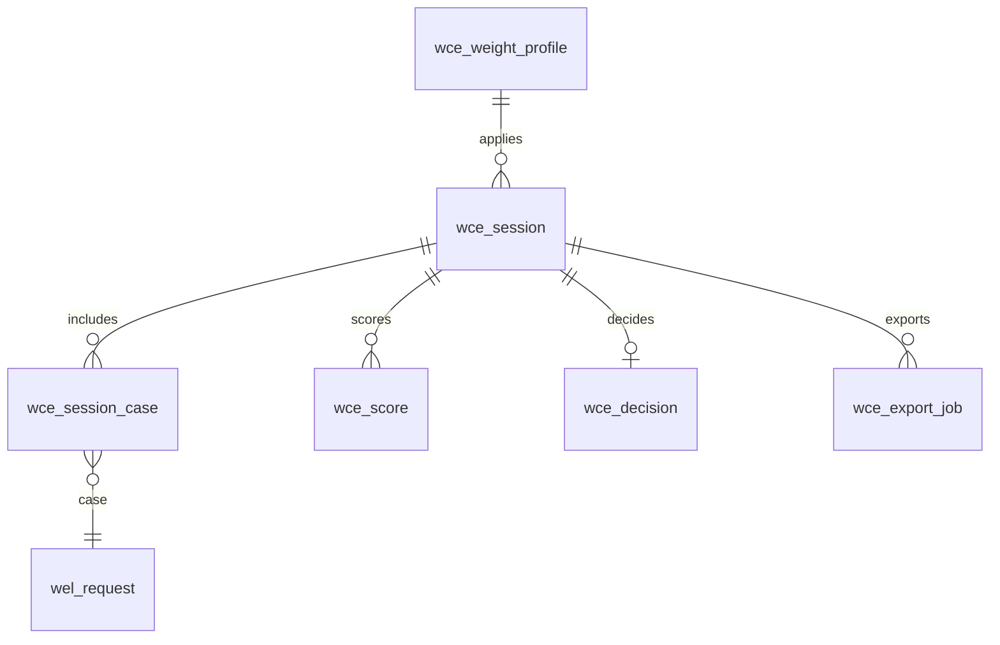
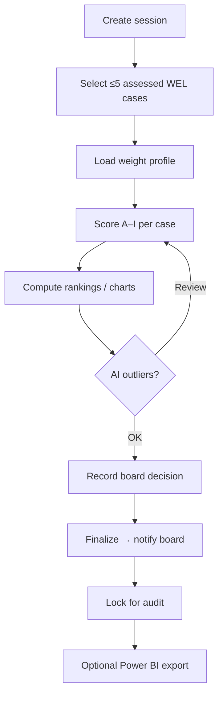

# M06 — Welfare Comparison Engine

| Field | Value |
|---|---|
| **Module code** | `WCE` |
| **FRS** | FR-WCE-* |
| **Epic** | EPIC-06 |
| **Overview** | [04-MODULE-DESIGN](../04-MODULE-DESIGN.md) |

---

## 1. Purpose

Enable fair executive welfare decisions by comparing **up to five** cases across categories **A–I** with **tenant-configurable weighted scoring**, rankings, charts, audit lock, and **Power BI** export.

---

## 2. Features

- Select ≤ **5** assessed welfare cases per comparison session
- Categories (exact):  
  **A.** Eligibility · **B.** Documentation · **C.** Financial Assessment · **D.** Risk Assessment · **E.** Impact Assessment · **F.** Operational Feasibility · **G.** Management Review · **H.** Budget Availability · **I.** Recommendation
- Weighted scoring; weights sum to **100%**; versioned effective dates
- Rankings, scorecards, radar/bar charts
- Record board decision; lock session for audit
- Executive dashboard widgets
- Power BI dataset export (no confidential free-text by default)
- AI: weight suggestions / outlier highlights (advisory)
- Notify decision board on finalize

---

## 3. User Stories

| ID | Summary |
|---|---|
| [US-06-001](../05-USER-STORIES.md#us-06-001--select-up-to-five-cases) | Select up to five cases |
| [US-06-002](../05-USER-STORIES.md#us-06-002--score-categories-ai) | Score categories A–I |
| [US-06-003](../05-USER-STORIES.md#us-06-003--configurable-weights) | Configurable weights |
| [US-06-004](../05-USER-STORIES.md#us-06-004--rankings-and-charts) | Rankings and charts |
| [US-06-005](../05-USER-STORIES.md#us-06-005--record-board-decision) | Board decision |
| [US-06-006](../05-USER-STORIES.md#us-06-006--power-bi-export) | Power BI export |
| [US-06-007](../05-USER-STORIES.md#us-06-007--executive-wce-widget) | Executive widget |
| [US-06-008](../05-USER-STORIES.md#us-06-008--ai-outlier-highlight) | AI outlier highlight |
| [US-06-009](../05-USER-STORIES.md#us-06-009--notify-decision-board) | Notify board |
| [US-06-010](../05-USER-STORIES.md#us-06-010--audit-comparison-session) | Audit session |

---

## 4. Database Tables

| Table | Purpose |
|---|---|
| `wce_weight_profile` | Tenant weight versions (A–I) |
| `wce_session` | Comparison session header |
| `wce_session_case` | Cases in session (max 5) |
| `wce_score` | Per-case per-category scores |
| `wce_decision` | Board outcome |
| `wce_export_job` | Power BI / file export jobs |
| `wce_ai_insight` | Outlier / weight suggestions |

---

## 5. Fields

### Categories A–I (exact codes)

| Code | Name |
|---|---|
| A | Eligibility |
| B | Documentation |
| C | Financial Assessment |
| D | Risk Assessment |
| E | Impact Assessment |
| F | Operational Feasibility |
| G | Management Review |
| H | Budget Availability |
| I | Recommendation |

### `wce_weight_profile`

`id`, `tenant_id`, `version`, `weights_json` (A–I → %), `effective_from`, `created_by`

### `wce_session`

`id`, `name`, `status` (Draft/Scoring/Finalized/Locked), `weight_profile_id`, `created_by`, `finalized_at`, `locked_at`

### `wce_score`

`session_id`, `wel_request_id`, `category_code`, `score`, `scored_by`, `scored_at`

### Weighted total

`sum(score_c * weight_c)` normalized per policy (document scale 0–10 or 0–100 in tenant config).

---

## 6. Relationships

---

## 7. APIs

| Method | Path | Summary |
|---|---|---|
| `GET/PUT` | `/api/v1/wce/weight-profiles` | Manage weights |
| `POST` | `/api/v1/wce/sessions` | Create session |
| `POST` | `/api/v1/wce/sessions/{id}/cases` | Add cases (cap 5) |
| `PUT` | `/api/v1/wce/sessions/{id}/scores` | Upsert scores |
| `GET` | `/api/v1/wce/sessions/{id}/rankings` | Ranked totals + charts data |
| `POST` | `/api/v1/wce/sessions/{id}/finalize` | Decision + notify |
| `POST` | `/api/v1/wce/sessions/{id}/lock` | Immutable lock |
| `POST` | `/api/v1/wce/sessions/{id}/export/powerbi` | Export job |
| `POST` | `/api/v1/wce/sessions/{id}/ai/outliers` | AI highlights |

---

## 8. Workflows

---

## 9. Notifications

| Event | Channels |
|---|---|
| Session finalized | Email / Push to decision board |
| Export ready | Email / Push to requester |
| Lock completed | Auditor optional |

---

## 10. Reports

- Session scorecards (printable)
- Ranking tables
- Weight profile version history
- Decision outcomes linked to WEL cases
- Export audit pack

---

## 11. Dashboards

| Widget | Audience |
|---|---|
| Recent comparison sessions | Senior Pastor |
| Decision throughput | Welfare Lead |
| Budget availability vs awards | Finance Manager |
| Radar compare (in-session) | Board meeting UI |

---

## 12. AI Features

- Suggest weight adjustments
- Highlight score outliers / inconsistent scoring  
Human confirms; feature-flagged.

---

## 13. Security Controls

- Permission to compare / finalize / export
- No confidential WEL free-text in Power BI default extract
- Post-lock: read-only; no silent edits
- Auditor read-only session metadata
- Export permission separate from scoring

---

## 14. Validation Rules

- Hard cap **5** cases per session
- Only assessed (or policy-eligible) WEL cases
- Weights must sum to **100%**
- All A–I scores required before finalize (or warn per config)
- Finalize requires decision outcome
- Cannot unlock without break-glass + audit (if allowed)

---

## 15. Integration Requirements

| System | Need |
|---|---|
| WEL | Case selection + decision write-back links |
| Power BI | Secure dataset connector / export |
| Notification | Board finalize alerts |
| ANA | Executive WCE widgets |
| Audit | Full session trail |

---

## Document control

| Version | Date | Change |
|---|---|---|
| 1.0 | 2026-08-23 | Initial M06 design |
