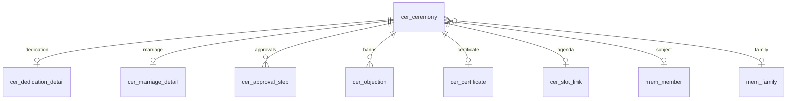
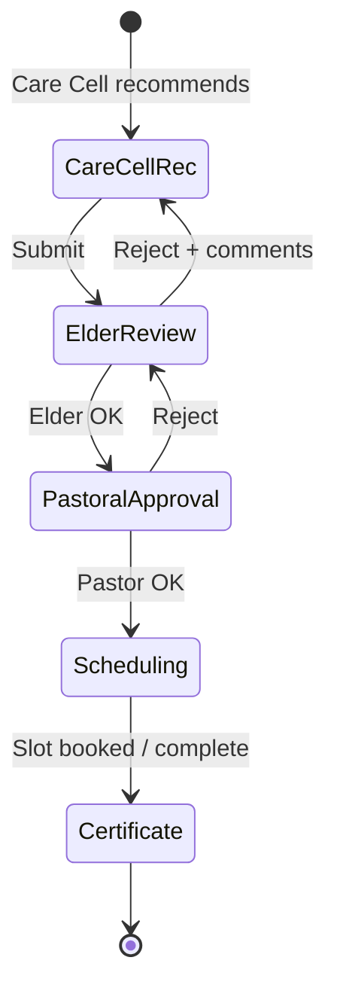
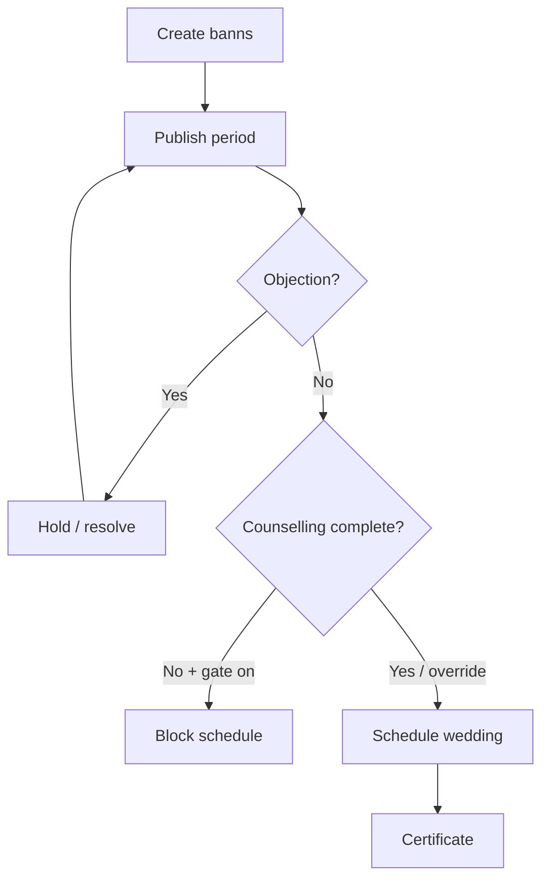

# M07 — Church Ceremonies & Member Functions

| Field | Value |
|---|---|
| **Module code** | `CER` |
| **FRS** | FR-CER-* |
| **Epic** | EPIC-07 |
| **Overview** | [04-MODULE-DESIGN](../04-MODULE-DESIGN.md) |

---

## 1. Purpose

Manage the church ceremony catalogue—especially **baby dedication** (Care Cell → Elder → Pastor → Schedule → Certificate), **marriage banns / weddings**, baptisms, receptions, funerals, and related certificates—linked to members/families and service slots.

---

## 2. Features

- Ceremony types: Baby Dedication, Baptism, Membership Reception, Thanksgiving, Wedding Anniversary, House Blessing, Marriage Banns, Wedding Service, Funeral Service, Memorial Service
- Baby dedication data: Child Name, Given Name, DOB, Place of Birth, Father Name, Mother Name (live data ACL; docs use placeholders)
- Dedication workflow: **Care Cell Recommendation → Elder Review → Pastoral Approval → Scheduling → Certificate Generation**
- Marriage: Bride, Groom, Parents, Wedding Date, Venue, Counselling Status
- Banns publication period + objection tracking
- Wedding schedule + certificate; optional block if counselling incomplete
- Baptism ceremony updates MEM baptism fields
- Membership Reception for class completers
- Funeral/memorial with sensitive flags (stop birthday automation)
- SLOT insert for scheduled ceremonies
- Notifications on approval/schedule

---

## 3. User Stories

| ID | Summary |
|---|---|
| [US-07-001](../05-USER-STORIES.md#us-07-001--ceremony-catalogue) | Ceremony catalogue |
| [US-07-002](../05-USER-STORIES.md#us-07-002--baby-dedication-data-capture) | Dedication data capture |
| [US-07-003](../05-USER-STORIES.md#us-07-003--dedication-approval-chain) | Care Cell→Elder→Pastor |
| [US-07-004](../05-USER-STORIES.md#us-07-004--schedule-dedication-in-service) | Schedule in service slot |
| [US-07-005](../05-USER-STORIES.md#us-07-005--marriage-banns) | Marriage banns |
| [US-07-006](../05-USER-STORIES.md#us-07-006--counselling-gate-for-wedding) | Counselling gate |
| [US-07-007](../05-USER-STORIES.md#us-07-007--wedding-certificate) | Wedding certificate |
| [US-07-008](../05-USER-STORIES.md#us-07-008--funeral--memorial-records) | Funeral / memorial |
| [US-07-009](../05-USER-STORIES.md#us-07-009--baptism-ceremony--member-update) | Baptism → MEM sync |
| [US-07-010](../05-USER-STORIES.md#us-07-010--ceremony-notifications) | Schedule notifications |
| [US-07-011](../05-USER-STORIES.md#us-07-011--membership-reception-after-class) | Membership reception |

---

## 4. Database Tables

| Table | Purpose |
|---|---|
| `cer_ceremony` | Common ceremony header |
| `cer_dedication_detail` | Baby dedication fields |
| `cer_marriage_detail` | Banns / wedding fields |
| `cer_baptism_detail` | Baptism ceremony fields |
| `cer_funeral_detail` | Funeral/memorial fields |
| `cer_approval_step` | Workflow steps |
| `cer_objection` | Banns objections |
| `cer_certificate` | Generated certificate metadata |
| `cer_slot_link` | Link to SLOT insertion |

---

## 5. Fields

### `cer_ceremony` (key)

`id`, `tenant_id`, `campus_id`, `type`, `status`, `family_id`, `primary_member_id`, `requested_by`, `scheduled_at`, `slot_insertion_id`, `created_at`

### `cer_dedication_detail`

`ceremony_id`, `child_name`, `given_name`, `date_of_birth`, `place_of_birth`, `father_name`, `mother_name`, `care_cell_id`

### `cer_marriage_detail`

`ceremony_id`, `bride_member_id`, `groom_member_id`, `bride_parents`, `groom_parents`, `wedding_date`, `venue`, `counselling_status`, `banns_start`, `banns_end`

### `cer_certificate`

`ceremony_id`, `template_id`, `file_id`, `issued_at`, `issued_by`

---

## 6. Relationships

---

## 7. APIs

| Method | Path | Summary |
|---|---|---|
| `POST` | `/api/v1/ceremonies` | Create ceremony request |
| `GET` | `/api/v1/ceremonies` | List/filter by type/status |
| `POST` | `/api/v1/ceremonies/{id}/approve` | Advance approval step |
| `POST` | `/api/v1/ceremonies/{id}/schedule` | Schedule + optional SLOT |
| `POST` | `/api/v1/ceremonies/{id}/certificate` | Generate certificate |
| `POST` | `/api/v1/ceremonies/{id}/objections` | Lodge/resolve objection |
| `GET` | `/api/v1/ceremonies/reception-candidates` | Class completers |
| `POST` | `/api/v1/ceremonies/{id}/complete` | Complete + MEM sync |

---

## 8. Workflows

### Baby dedication

### Marriage banns → wedding

---

## 9. Notifications

| Event | Channels |
|---|---|
| Approval step pending | Email / Push |
| Scheduled / rescheduled | Email / WhatsApp / Push to owners |
| Objection lodged | Pastor / Elder |
| Certificate ready | Admin / family contact (policy) |

---

## 10. Reports

- Ceremony calendar by type/campus
- Dedication / baptism / wedding registers
- Banns objections log
- Reception candidates vs completed
- Funeral/memorial pastoral care list (ACL)

---

## 11. Dashboards

| Widget | Audience |
|---|---|
| Upcoming ceremonies | Pastor, Admin |
| Dedication pipeline | Elder |
| Banns in publication | Pastor |
| Reception eligibility | Ministry Leader |

---

## 12. AI Features

- Optional scheduling conflict hints via SLOT AI
- No auto-approval of pastoral steps  
(Primary AI sits in SLOT/ROST; CER remains human-governed.)

---

## 13. Security Controls

- Dedication/marriage personal fields ACL
- Funeral sensitive distribution lists
- Certificate download controlled
- Counselling-gate override: Senior Pastor + audit
- Audit every approval and objection

---

## 14. Validation Rules

- Dedication: required child/parent fields; DOB not future
- Cannot schedule dedication before Pastoral Approval
- Wedding blocked if counselling incomplete when tenant flag on
- Active objection holds wedding schedule
- Baptism complete updates MEM baptism in single transaction
- Certificate only after ceremony Complete (or policy)

---

## 15. Integration Requirements

| System | Need |
|---|---|
| MEM | Family/member links; baptism/status side effects |
| SLOT | Insert scheduled function |
| COUN | Counselling status for marriage gate |
| File | Certificates ≤50MB PDF |
| Notification | Approval/schedule |
| COM | Limited funeral announcements |
| Workflow | Dedication & banns engines |

---

## Document control

| Version | Date | Change |
|---|---|---|
| 1.0 | 2026-08-23 | Initial M07 design |
