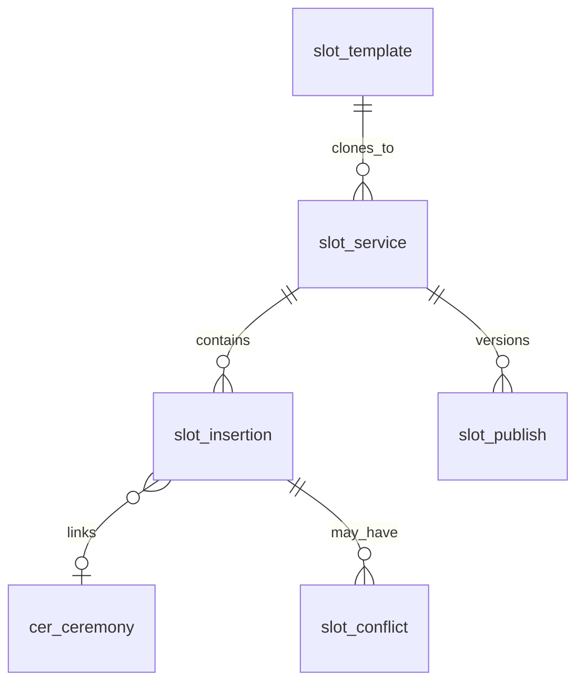
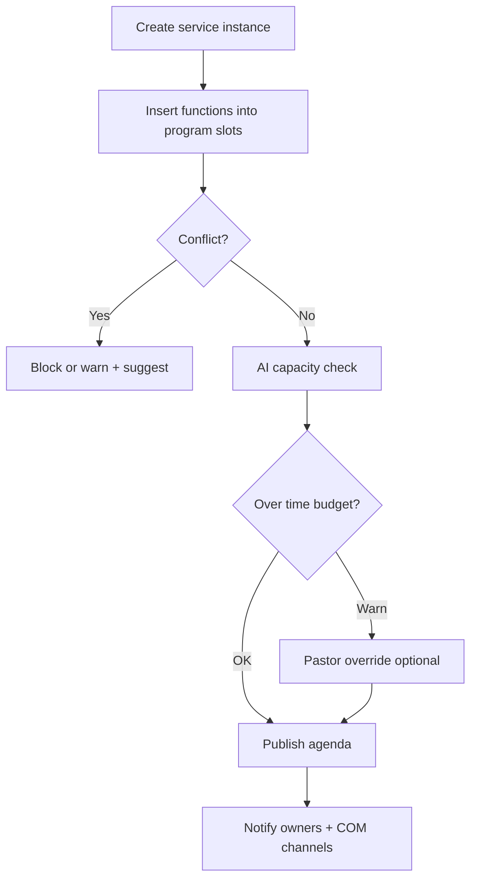

# M08 — Service Slot Management

| Field | Value |
|---|---|
| **Module code** | `SLOT` |
| **FRS** | FR-SLOT-* |
| **Epic** | EPIC-08 |
| **Overview** | [04-MODULE-DESIGN](../04-MODULE-DESIGN.md) |

---

## 1. Purpose

Structure worship agendas for **Friday Main Service**, **Sunday Main Service**, and **Special Service** by inserting church functions into fixed **program slots**, with conflict detection, publish-to-COM, and AI capacity/optimization assist.

---

## 2. Features

- Service types: **Friday Main Service**, **Sunday Main Service**, **Special Service**
- Program slots: **Before Worship**, **After Worship**, **Before Sermon**, **After Sermon**, **During Announcements**, **Before Closing Prayer**
- Insert function/ceremony with duration + owner
- Prevent double-booking same service/slot/time
- Link CER ceremonies
- Publish agenda to COM / display feed
- Special service templates
- AI: capacity validation, agenda optimization, conflict detection across campuses/resources
- Mobile read-only agenda
- Owner change notifications

---

## 3. User Stories

| ID | Summary |
|---|---|
| [US-08-001](../05-USER-STORIES.md#us-08-001--define-service-instances) | Define service instances |
| [US-08-002](../05-USER-STORIES.md#us-08-002--insert-into-program-slot) | Insert into program slot |
| [US-08-003](../05-USER-STORIES.md#us-08-003--conflict-detection) | Conflict detection |
| [US-08-004](../05-USER-STORIES.md#us-08-004--publish-agenda) | Publish agenda |
| [US-08-005](../05-USER-STORIES.md#us-08-005--ai-capacity-validation) | AI capacity validation |
| [US-08-006](../05-USER-STORIES.md#us-08-006--ai-agenda-optimization) | AI agenda optimization |
| [US-08-007](../05-USER-STORIES.md#us-08-007--special-service-template) | Special service templates |
| [US-08-008](../05-USER-STORIES.md#us-08-008--mobile-agenda-view) | Mobile agenda |
| [US-08-009](../05-USER-STORIES.md#us-08-009--link-ceremony-to-slot) | Link ceremony |
| [US-08-010](../05-USER-STORIES.md#us-08-010--owner-change-notification) | Owner change notify |

---

## 4. Database Tables

| Table | Purpose |
|---|---|
| `slot_service` | Service instance (type, campus, datetime) |
| `slot_program_slot` | Enum/config of program slot types |
| `slot_insertion` | Function placed in a slot |
| `slot_conflict` | Detected conflicts log |
| `slot_publish` | Published agenda versions |
| `slot_template` | Special service templates |
| `slot_ai_suggestion` | Capacity/optimize suggestions |

---

## 5. Fields

### Service types (exact)

`Friday Main Service` | `Sunday Main Service` | `Special Service`

### Program slots (exact)

`Before Worship` | `After Worship` | `Before Sermon` | `After Sermon` | `During Announcements` | `Before Closing Prayer`

### `slot_service`

`id`, `tenant_id`, `campus_id`, `service_type`, `starts_at`, `ends_at`, `timezone`, `publish_state`, `title`

### `slot_insertion`

`id`, `service_id`, `program_slot`, `title`, `duration_minutes`, `owner_user_id`, `ceremony_id`, `sort_order`, `status`

---

## 6. Relationships

---

## 7. APIs

| Method | Path | Summary |
|---|---|---|
| `POST` | `/api/v1/services` | Create service instance |
| `GET` | `/api/v1/services` | Calendar/list |
| `POST` | `/api/v1/services/{id}/insertions` | Insert function |
| `PATCH` | `/api/v1/insertions/{id}` | Update / reassign owner |
| `DELETE` | `/api/v1/insertions/{id}` | Soft remove |
| `POST` | `/api/v1/services/{id}/publish` | Publish agenda |
| `GET` | `/api/v1/services/{id}/agenda` | Public/mobile agenda |
| `POST` | `/api/v1/services/{id}/ai/validate-capacity` | AI capacity |
| `POST` | `/api/v1/services/{id}/ai/optimize` | AI optimize |
| `POST` | `/api/v1/service-templates` | CRUD templates |

---

## 8. Workflows

---

## 9. Notifications

| Event | Channels |
|---|---|
| Agenda published / changed | Email / Push to insertion owners |
| Owner reassigned | Email / Push (diff summary) |
| Publish day quiet-hours policy | Configurable |

---

## 10. Reports

- Service agenda history (versioned)
- Conflict incidents
- Average duration by program slot
- Special service template usage
- Ceremony-linked insertions count

---

## 11. Dashboards

| Widget | Audience |
|---|---|
| This week’s services | Pastor, Ministry Leader |
| Unowned / draft insertions | Elder |
| Capacity warnings | Pastor |
| Publish status by campus | Admin |

---

## 12. AI Features

- Capacity Validation (time budget vs service length)
- Agenda Optimization (order suggestions; no auto-reorder)
- Conflict Detection across campuses/resources

---

## 13. Security Controls

- Create/publish restricted to Pastor/Elder/Admin/Ministry Leader matrix
- Volunteers: read-only agenda
- Audit publish and overrides
- COM publish respects segment permissions

---

## 14. Validation Rules

- `service_type` and `program_slot` from exact enums
- Duration &gt; 0; owner required
- Same service + overlapping time in same program slot → conflict
- Cannot publish empty mandatory sections if tenant requires
- Ceremony link must be schedule-eligible (CER status)

---

## 15. Integration Requirements

| System | Need |
|---|---|
| CER | Bidirectional ceremony link |
| COM | Publish agenda channels |
| ROST | Optional sermon/worship alignment |
| Notification | Owner alerts |
| AI Copilot | Capacity/optimize |
| Display feed (optional) | Published agenda JSON |

---

## Document control

| Version | Date | Change |
|---|---|---|
| 1.0 | 2026-08-23 | Initial M08 design |
