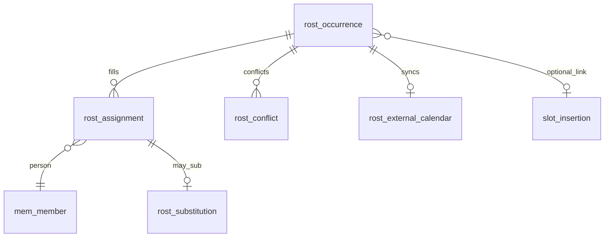
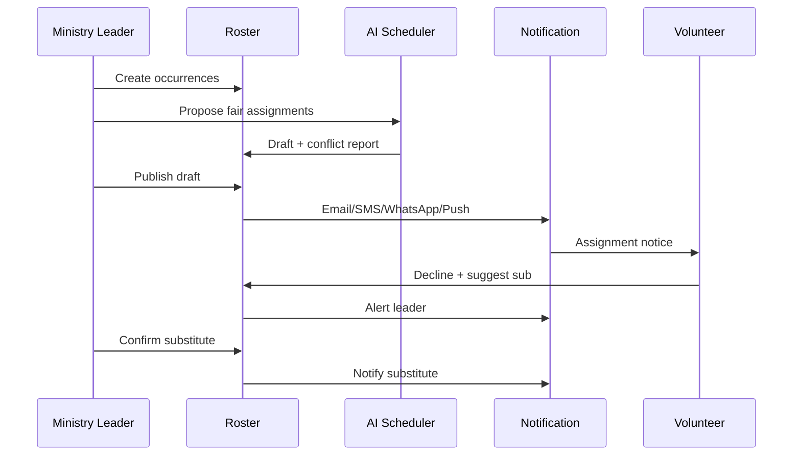

# M09 — Church Activity Roster

| Field | Value |
|---|---|
| **Module code** | `ROST` |
| **FRS** | FR-ROST-* |
| **Epic** | EPIC-09 |
| **Overview** | [04-MODULE-DESIGN](../04-MODULE-DESIGN.md) |

---

## 1. Purpose

Centralize scheduling for sermons, counselling duties, hospital visits, Care Cell meetings, ministry events, worship teams, volunteers, and Friday School—with **AI conflict/fairness scheduling** and omnichannel assignment notifications (**Email / SMS / WhatsApp / Push**).

---

## 2. Features

- Activity types: **Sermons**, **Counselling**, **Hospital Visits**, **Care Cell Meetings**, **Ministry Events**, **Worship Teams**, **Volunteers**, **Friday School**
- Dated occurrences with campus, location, role
- Assign people; capture availability and substitutions
- AI Rotation Engine, conflict detection (double-book), availability matching, fair-load metrics
- Notifications on assign/change/remind via all four channels
- Hospital visit sensitivity flags (limit COM content)
- Sermon series metadata
- Friday School scoped views for teachers
- Optional Microsoft 365 calendar sync

---

## 3. User Stories

| ID | Summary |
|---|---|
| [US-09-001](../05-USER-STORIES.md#us-09-001--roster-activity-types) | Activity types |
| [US-09-002](../05-USER-STORIES.md#us-09-002--assign-person-to-occurrence) | Assign person |
| [US-09-003](../05-USER-STORIES.md#us-09-003--substitution-workflow) | Substitution |
| [US-09-004](../05-USER-STORIES.md#us-09-004--omnichannel-assignment-notify) | Omnichannel notify |
| [US-09-005](../05-USER-STORIES.md#us-09-005--ai-conflict-detection) | AI conflict detection |
| [US-09-006](../05-USER-STORIES.md#us-09-006--ai-rotation--fairness) | AI rotation & fairness |
| [US-09-007](../05-USER-STORIES.md#us-09-007--availability-capture) | Availability |
| [US-09-008](../05-USER-STORIES.md#us-09-008--friday-school-teacher-scope) | Friday School scope |
| [US-09-009](../05-USER-STORIES.md#us-09-009--m365-calendar-sync) | M365 calendar sync |
| [US-09-010](../05-USER-STORIES.md#us-09-010--hospital-visit-roster) | Hospital visits |
| [US-09-011](../05-USER-STORIES.md#us-09-011--sermon-speaker-schedule) | Sermon schedule |

---

## 4. Database Tables

| Table | Purpose |
|---|---|
| `rost_activity_type` | Type dictionary (sermon, hospital, etc.) |
| `rost_occurrence` | Dated activity instance |
| `rost_assignment` | Person assigned to occurrence |
| `rost_availability` | Recurring availability + exceptions |
| `rost_substitution` | Decline / substitute workflow |
| `rost_conflict` | Detected booking conflicts |
| `rost_fairness_metric` | Load-balance stats |
| `rost_ai_draft` | AI-proposed roster pending publish |
| `rost_external_calendar` | M365 event ids |

---

## 5. Fields

### Activity types (exact coverage)

`Sermons`, `Counselling`, `Hospital Visits`, `Care Cell Meetings`, `Ministry Events`, `Worship Teams`, `Volunteers`, `Friday School`

### `rost_occurrence`

`id`, `tenant_id`, `campus_id`, `activity_type`, `title`, `starts_at`, `ends_at`, `location`, `care_cell_id`, `sensitivity_flag`, `series_meta_json`, `status`

### `rost_assignment`

`occurrence_id`, `member_id`, `role_label`, `status` (Assigned/Confirmed/Declined/Substituted), `notified_at`

### `rost_availability`

`member_id`, `rrule`, `exception_dates`, `channels_pref`

---

## 6. Relationships

---

## 7. APIs

| Method | Path | Summary |
|---|---|---|
| `POST` | `/api/v1/roster/occurrences` | Create occurrence |
| `GET` | `/api/v1/roster/occurrences` | Calendar/list |
| `POST` | `/api/v1/roster/occurrences/{id}/assignments` | Assign |
| `POST` | `/api/v1/roster/assignments/{id}/decline` | Decline + suggest sub |
| `POST` | `/api/v1/roster/assignments/{id}/confirm-sub` | Confirm substitute |
| `PUT` | `/api/v1/roster/availability` | Set availability |
| `POST` | `/api/v1/roster/ai/propose` | AI draft roster |
| `POST` | `/api/v1/roster/ai/drafts/{id}/publish` | Human publish |
| `POST` | `/api/v1/roster/occurrences/{id}/sync-m365` | Calendar sync |
| `GET` | `/api/v1/roster/friday-school/mine` | Teacher-scoped |

---

## 8. Workflows

---

## 9. Notifications

| Event | Channels (all supported) |
|---|---|
| Assigned | Email, SMS, WhatsApp, Push |
| Changed / cancelled | Same |
| Reminder cadence | Configurable |
| Hospital sensitivity | Omit clinical detail; minimal content |

---

## 10. Reports

- Coverage gaps by activity type
- Volunteer load / fairness metrics
- Substitution rates
- Hospital visit outcomes (ACL)
- Sermon calendar / series
- Friday School teacher attendance

---

## 11. Dashboards

| Widget | Audience |
|---|---|
| This week’s roster | Ministry Leader |
| Unfilled roles | Pastor |
| Fairness heat | Pastor |
| My upcoming duties | Volunteer / Member portal |
| Sync failures (M365) | Admin |

---

## 12. AI Features

- Rotation Engine (fair recurring assignments)
- Conflict Detection (person double-booked)
- Availability Matching
- Fair Assignment metrics  
Draft → human publish required.

---

## 13. Security Controls

- Friday School teacher sees own classes only
- Hospital sensitivity limits COM
- Counselling roster links must not expose COUN notes
- M365 sync uses least-privilege Graph scopes
- Audit publish and overrides

---

## 14. Validation Rules

- Ends_at &gt; starts_at
- Assignment conflict warn/block per config
- Substitute must be eligible role/skills when required
- Sensitivity flag required for hospital visits
- AI draft cannot notify until published

---

## 15. Integration Requirements

| System | Need |
|---|---|
| MEM | Assignees, skills |
| Notification | Four channels |
| WhatsApp / SMS / Email / Push | Templates |
| M365 | Calendar sync |
| SLOT | Optional sermon/agenda link |
| COUN | Duty scheduling without note leakage |
| ANA | Volunteer participation |

---

## Document control

| Version | Date | Change |
|---|---|---|
| 1.0 | 2026-08-23 | Initial M09 design |
