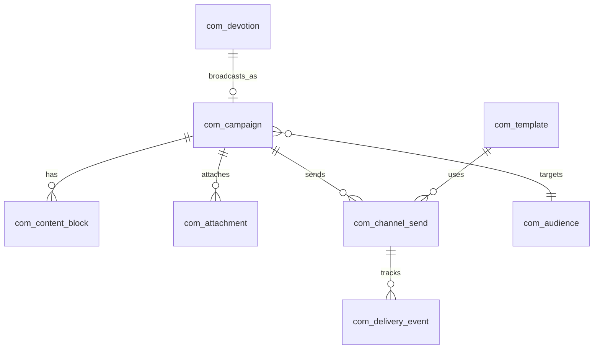
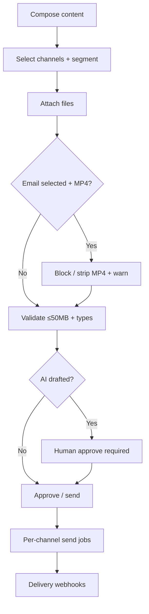

# M10 — Communication & Digital Engagement

| Field | Value |
|---|---|
| **Module code** | `COM` |
| **FRS** | FR-COM-* |
| **Epic** | EPIC-10 |
| **Overview** | [04-MODULE-DESIGN](../04-MODULE-DESIGN.md) |

---

## 1. Purpose

Deliver omnichannel church communications—**flyers, videos, announcements, events, daily devotions**—via Email, WhatsApp, SMS, Push, and Member Portal, with strict **file type/size rules** and human-approved AI content assist.

---

## 2. Features

- Channels: Email, WhatsApp, SMS, Mobile App (Push), Member Portal
- Content types: Flyers, Videos, Announcements, Events, Daily Devotions
- Files: **PDF, JPG, JPEG, PNG, BMP, GIF, MP4**; max **50 MB**
- **Email special rule:** images + PDF only; **no MP4**
- Audience segments: campus, Care Cell, ministry, status, custom lists
- Daily devotion parts: Verse of the Day, Daily Prayer, Reflection, Devotional Article
- Push types: Event Reminders, Daily Devotions, Emergency Alerts, Counselling Follow-Ups, Welfare Updates, Prayer Requests
- Scheduling: Immediate, Scheduled, Recurring
- Delivery logs without unnecessary PII
- WhatsApp template library
- Optional send via Microsoft Graph
- AI devotion/announcement drafts (approve before send)

---

## 3. User Stories

| ID | Summary |
|---|---|
| [US-10-001](../05-USER-STORIES.md#us-10-001--multi-channel-composer) | Multi-channel composer |
| [US-10-002](../05-USER-STORIES.md#us-10-002--attachment-policy) | Attachment policy |
| [US-10-003](../05-USER-STORIES.md#us-10-003--daily-devotion-broadcast) | Daily devotion |
| [US-10-004](../05-USER-STORIES.md#us-10-004--push-scheduling-modes) | Push scheduling modes |
| [US-10-005](../05-USER-STORIES.md#us-10-005--emergency-alert) | Emergency alert |
| [US-10-006](../05-USER-STORIES.md#us-10-006--event-reminder-push) | Event reminders |
| [US-10-007](../05-USER-STORIES.md#us-10-007--ai-devotion-draft) | AI devotion draft |
| [US-10-008](../05-USER-STORIES.md#us-10-008--flyer-distribution) | Flyer distribution |
| [US-10-009](../05-USER-STORIES.md#us-10-009--delivery-logging) | Delivery logging |
| [US-10-010](../05-USER-STORIES.md#us-10-010--whatsapp-template-library) | WhatsApp templates |
| [US-10-011](../05-USER-STORIES.md#us-10-011--m365-email-send-path) | M365 email path |
| [US-10-012](../05-USER-STORIES.md#us-10-012--video-share-non-email) | MP4 non-email only |

---

## 4. Database Tables

| Table | Purpose |
|---|---|
| `com_campaign` | Campaign / message header |
| `com_content_block` | Flyer/video/announcement/devotion parts |
| `com_attachment` | File metadata + channel eligibility |
| `com_audience` | Segment definition |
| `com_channel_send` | Per-channel send job |
| `com_delivery_event` | Provider status webhooks |
| `com_template` | WhatsApp/Email templates |
| `com_push_schedule` | Immediate/scheduled/recurring |
| `com_devotion` | Daily devotion package |
| `com_consent` | Channel consent records |

---

## 5. Fields

### Attachment policy

| Rule | Value |
|---|---|
| Allowed types | PDF, JPG, JPEG, PNG, BMP, GIF, MP4 |
| Max size | 50 MB |
| Email | Images + PDF only; **MP4 rejected** |
| WhatsApp / Portal / App | Full allowed set ≤50MB |

### `com_campaign`

`id`, `tenant_id`, `campus_id`, `content_type`, `title`, `body`, `status` (Draft/Approved/Sending/Sent/Cancelled), `created_by`, `approved_by`, `scheduled_at`

### `com_push_schedule`

`mode` (`Immediate`|`Scheduled`|`Recurring`), `rrule`, `push_type`, `timezone`

### `com_devotion`

`verse`, `daily_prayer`, `reflection`, `article`, `ai_draft_flag`

---

## 6. Relationships

---

## 7. APIs

| Method | Path | Summary |
|---|---|---|
| `POST` | `/api/v1/com/campaigns` | Create campaign |
| `POST` | `/api/v1/com/campaigns/{id}/attachments` | Upload (policy check) |
| `POST` | `/api/v1/com/campaigns/{id}/approve` | Human approve |
| `POST` | `/api/v1/com/campaigns/{id}/send` | Send / schedule |
| `GET` | `/api/v1/com/campaigns/{id}/deliveries` | Delivery status |
| `POST` | `/api/v1/com/devotions` | Compose devotion |
| `POST` | `/api/v1/com/push-schedules` | Push modes |
| `POST` | `/api/v1/com/emergency` | Emergency alert (gated) |
| `CRUD` | `/api/v1/com/templates` | Template library |
| `POST` | `/api/v1/com/ai/draft` | AI content draft |

---

## 8. Workflows

---

## 9. Notifications

COM **is** the notification fabric for many modules. Additionally:

| Event | Notes |
|---|---|
| Emergency alert | Permission-gated; quiet-hours override confirm |
| Campaign failed | Admin alert |
| Devotion published | Push / WhatsApp / Email / Portal |

Never embed COUN note bodies or WEL bank details in templates.

---

## 10. Reports

- Delivery success by channel
- Bounce / opt-out rates
- Devotion engagement (opens where available)
- Emergency send audit
- Attachment rejection reasons (policy)

---

## 11. Dashboards

| Widget | Audience |
|---|---|
| Channel health | Admin |
| Upcoming scheduled sends | Ministry Leader |
| Devotion streak / reach | Pastor |
| Emergency last-send | Senior Pastor |

---

## 12. AI Features

- Devotion drafts (verse/prayer/reflection/article assist)
- Announcement tone suggestions  
Must approve before send; safety filter; feature-flagged.

---

## 13. Security Controls

- Segment export ACL
- Emergency send restricted to Senior Pastor (+ delegates)
- Consent enforced per channel
- Delivery logs: status + provider ids; no full body PII in app logs
- Secrets for providers in secure store

---

## 14. Validation Rules

- File type ∈ allow-list; size ≤ 50MB
- Email channel rejects MP4
- Recipients must have consent for channel
- Recurring push requires valid RRULE + campus TZ
- AI draft cannot transition to Sent without `approved_by`

---

## 15. Integration Requirements

| System | Need |
|---|---|
| WhatsApp Business API | Templates + webhooks |
| Email SMTP / M365 Graph | Switchable |
| SMS provider | Abstraction + cost controls |
| APNs / FCM | Push |
| File service | Attachments |
| MEM | Segments + consent |
| SLOT | Agenda publish |
| ANA | Delivery metrics |

---

## Document control

| Version | Date | Change |
|---|---|---|
| 1.0 | 2026-08-23 | Initial M10 design |
