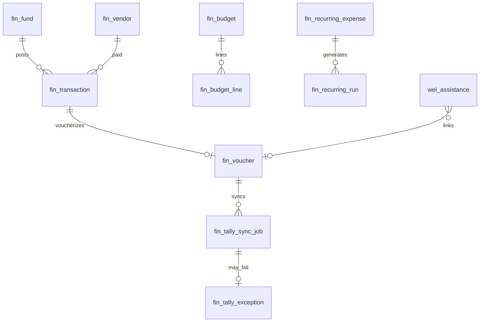
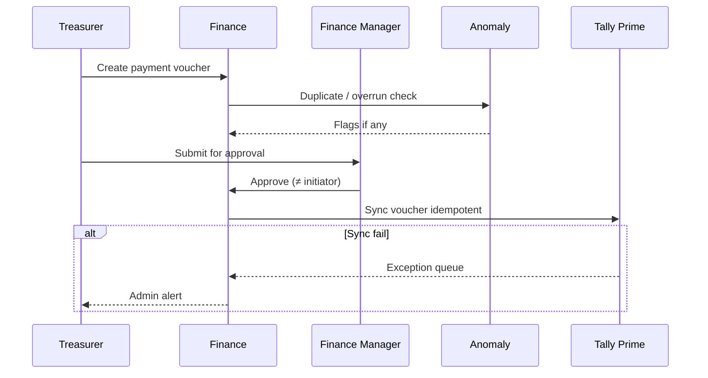

# M11 — Finance Management

| Field | Value |
|---|---|
| **Module code** | `FIN` |
| **FRS** | FR-FIN-* |
| **Epic** | EPIC-11 |
| **Overview** | [04-MODULE-DESIGN](../04-MODULE-DESIGN.md) |

---

## 1. Purpose

Provide enterprise church finance: **donations, tithes, offerings, welfare funds, mission funds, budgeting, cash management, vendors, recurring expenses**, multi-currency operations, **Tally Prime** sync, and **AI anomaly / forecast** assist—with segregation of duties.

---

## 2. Features

- Submodules: Donations, Tithes, Offerings, Welfare Funds, Mission Funds, Budgeting, Cash Management, Vendor Management, Recurring Expenses
- Recurring examples: Friday Worship Hall Rental, Intercession Hall Rental, Friday School Rental, Women's Fellowship Rental, Men's Fellowship Rental, Utilities, Internet, Cleaning, Security
- Multi-currency: **OMR, USD, EUR, GBP, AED, SAR, INR, QAR, KWD, BHD**
- FX rates, exchange gain/loss, foreign missions reporting
- SoD: create vs approve above threshold
- Tally Prime: ledger sync, receipt/payment/journal vouchers, bank reconciliation; idempotent + exception queue
- AI: budget/cashflow forecasts, expense analysis, fund utilization, anomaly detection (duplicates, overspend, budget overrun, FX risk, vendor risk)
- Link WEL disbursements to Welfare Fund vouchers

---

## 3. User Stories

| ID | Summary |
|---|---|
| [US-11-001](../05-USER-STORIES.md#us-11-001--record-titheofferingdonation) | Record tithe/offering/donation |
| [US-11-002](../05-USER-STORIES.md#us-11-002--multi-currency-capture) | Multi-currency |
| [US-11-003](../05-USER-STORIES.md#us-11-003--welfare--mission-funds) | Welfare & mission funds |
| [US-11-004](../05-USER-STORIES.md#us-11-004--recurring-expenses) | Recurring expenses |
| [US-11-005](../05-USER-STORIES.md#us-11-005--vendor-management) | Vendors |
| [US-11-006](../05-USER-STORIES.md#us-11-006--budgeting) | Budgeting |
| [US-11-007](../05-USER-STORIES.md#us-11-007--tally-prime-voucher-sync) | Tally voucher sync |
| [US-11-008](../05-USER-STORIES.md#us-11-008--bank-reconciliation) | Bank reconciliation |
| [US-11-009](../05-USER-STORIES.md#us-11-009--ai-anomaly-detection) | AI anomalies |
| [US-11-010](../05-USER-STORIES.md#us-11-010--ai-cashflow-forecast) | AI cashflow forecast |
| [US-11-011](../05-USER-STORIES.md#us-11-011--foreign-missions-gift) | Foreign missions gift |
| [US-11-012](../05-USER-STORIES.md#us-11-012--sod-payment-approval) | SoD payment approval |
| [US-11-013](../05-USER-STORIES.md#us-11-013--integration-health-for-tallym365) | Integration health |

---

## 4. Database Tables

| Table | Purpose |
|---|---|
| `fin_fund` | Fund master (welfare, mission, general, etc.) |
| `fin_ledger_account` | Chart of accounts / Tally mapping |
| `fin_transaction` | Giving & payment transactions |
| `fin_voucher` | Receipt / payment / journal voucher |
| `fin_budget` | Budget headers by period/campus/ministry/fund |
| `fin_budget_line` | Budget lines |
| `fin_vendor` | Vendor master |
| `fin_recurring_expense` | Recurring expense definitions |
| `fin_recurring_run` | Generated draft payments |
| `fin_fx_rate` | Currency rates by date |
| `fin_cash_position` | Cash management snapshots |
| `fin_tally_sync_job` | Sync attempts |
| `fin_tally_exception` | Dead-letter / resolve UI |
| `fin_bank_recon` | Reconciliation workspace |
| `fin_anomaly` | AI/rule anomaly flags |
| `fin_approval` | SoD approval records |

---

## 5. Fields

### Currencies (exact)

`OMR`, `USD`, `EUR`, `GBP`, `AED`, `SAR`, `INR`, `QAR`, `KWD`, `BHD`

### `fin_transaction` (key)

`id`, `tenant_id`, `campus_id`, `txn_type` (Donation/Tithe/Offering/…), `member_id` nullable, `fund_id`, `amount`, `currency_code`, `base_amount`, `fx_rate`, `fx_rate_date`, `receipt_no`, `status`

### `fin_voucher`

`voucher_type` (Receipt/Payment/Journal), `tally_external_id`, `sync_status`, `idempotency_key`

### `fin_recurring_expense`

`name`, `vendor_id`, `amount`, `currency_code`, `rrule`, `fund_id`, `examples_tag` (hall rentals, utilities, …)

### `fin_anomaly`

`type` (DuplicatePayment/Overspending/BudgetOverrun/CurrencyRisk/VendorRisk), `severity`, `rationale`, `status` (Open/Ack/Overridden)

---

## 6. Relationships

---

## 7. APIs

| Method | Path | Summary |
|---|---|---|
| `POST` | `/api/v1/finance/transactions` | Record giving/payment |
| `GET` | `/api/v1/finance/funds` | Fund balances |
| `POST` | `/api/v1/finance/vouchers` | Create voucher |
| `POST` | `/api/v1/finance/vouchers/{id}/approve` | SoD approve |
| `POST` | `/api/v1/finance/vouchers/{id}/sync-tally` | Sync |
| `GET` | `/api/v1/finance/tally/exceptions` | Exception queue |
| `POST` | `/api/v1/finance/budgets` | Create budget |
| `CRUD` | `/api/v1/finance/vendors` | Vendors |
| `CRUD` | `/api/v1/finance/recurring-expenses` | Recurring |
| `GET` | `/api/v1/finance/fx-rates` | Rates |
| `POST` | `/api/v1/finance/bank-recon` | Recon workspace |
| `GET` | `/api/v1/finance/anomalies` | AI/rule flags |
| `GET` | `/api/v1/finance/forecasts` | AI forecasts |
| `GET` | `/api/v1/integrations/health` | Tally/M365 health |

---

## 8. Workflows

### Payment SoD + Tally

---

## 9. Notifications

| Event | Recipients |
|---|---|
| Approval required | Approver roles |
| Anomaly detected | Finance Manager |
| Tally sync failed | Admin / Treasurer |
| Budget overrun | Finance Manager / Pastor (policy) |

No full account numbers in SMS.

---

## 10. Reports

- Giving by type / campus / currency
- Fund balances & restricted funds
- Budget vs actual
- Vendor payment history
- Foreign missions by project/currency
- Tally sync success rate
- Anomaly register

---

## 11. Dashboards

| Widget | Audience |
|---|---|
| Giving YTD / period | Finance Manager, Senior Pastor |
| Fund utilization | Treasurer |
| Cash position | Finance Manager |
| Open anomalies | Finance Manager |
| Tally health | Admin |
| Missions FX | Treasurer |

---

## 12. AI Features

- Budget Forecasts, Cashflow Forecasts
- Expense Analysis, Fund Utilization
- Anomaly Detection: Duplicate Payments, Overspending, Budget Overruns, Currency Risks, Vendor Risks  
No silent auto-void; acknowledge/override with reason.

---

## 13. Security Controls

- MFA for Finance Manager, Treasurer, Auditor
- SoD enforced above threshold; break-glass audited
- Auditor read-only journals
- Field-level mask on sensitive bank fields
- Export of finance data permissioned + audited

---

## 14. Validation Rules

- Currency ∈ approved ISO list
- FX conversion requires rate date
- Approver ≠ initiator above threshold
- Idempotency key required for Tally sync
- Recurring run generates drafts only—still needs approval
- Period lock blocks posting when closed

---

## 15. Integration Requirements

| System | Need |
|---|---|
| Tally Prime XML/API | Ledgers, vouchers, bank recon |
| WEL | Disbursement vouchers |
| MEM | Optional giver link / anonymous policy |
| Notification | Approvals & anomalies |
| Power BI / ANA | Finance datasets |
| Secret store | Tally credentials / KMS |
| Integration health | FR-INT-008 |

---

## Document control

| Version | Date | Change |
|---|---|---|
| 1.0 | 2026-08-23 | Initial M11 design |
