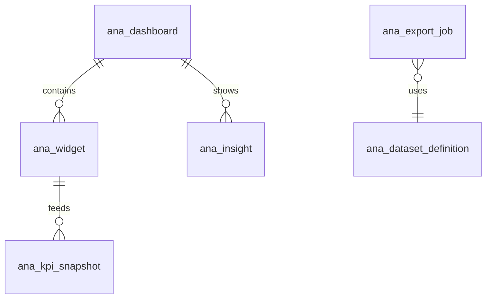
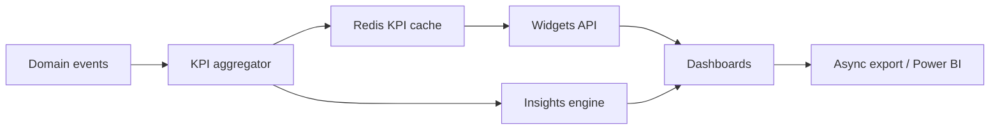
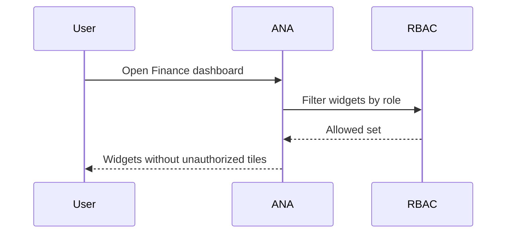

# M12 — Analytics & Executive Dashboards

| Field | Value |
|---|---|
| **Module code** | `ANA` |
| **FRS** | FR-ANA-* |
| **Epic** | EPIC-12 |
| **Overview** | [04-MODULE-DESIGN](../04-MODULE-DESIGN.md) |

---

## 1. Purpose

Deliver **role-aware executive and operational dashboards** across membership, visitors, care, prayer, counselling, welfare, finance, communication, and events—plus **AI insights**—without exposing confidential counselling note text or unnecessary PII.

---

## 2. Features

- Dashboards: Membership, Visitors, Care Cells, Prayer, Counselling, Welfare, Finance, Communication, Events
- Filters: campus, date range, ministry (tenant implicit)
- Widget RBAC (e.g., finance widgets only for FIN roles)
- Export aggregates: CSV / Excel / PDF; **Power BI** dataset export
- AI Insights Engine: Growth, Attendance, Giving, Ministry Performance, Volunteer Participation, Welfare Demand, Counselling Trends
- Near-real-time KPI cache (Redis/events); heavy reports async
- Care Cell scoped widgets for leaders
- Staleness indicator + admin manual refresh

---

## 3. User Stories

| ID | Summary |
|---|---|
| [US-12-001](../05-USER-STORIES.md#us-12-001--membership-dashboard) | Membership dashboard |
| [US-12-002](../05-USER-STORIES.md#us-12-002--visitor-funnel-dashboard) | Visitor funnel |
| [US-12-003](../05-USER-STORIES.md#us-12-003--care-cell-health) | Care Cell health |
| [US-12-004](../05-USER-STORIES.md#us-12-004--welfare--counselling-aggregates) | Welfare & counselling aggregates |
| [US-12-005](../05-USER-STORIES.md#us-12-005--finance-executive-dashboard) | Finance executive |
| [US-12-006](../05-USER-STORIES.md#us-12-006--communication-performance) | Communication performance |
| [US-12-007](../05-USER-STORIES.md#us-12-007--events-dashboard) | Events dashboard |
| [US-12-008](../05-USER-STORIES.md#us-12-008--power-bi-export) | Power BI export |
| [US-12-009](../05-USER-STORIES.md#us-12-009--ai-insights-engine) | AI insights engine |
| [US-12-010](../05-USER-STORIES.md#us-12-010--async-heavy-reports) | Async heavy reports |
| [US-12-011](../05-USER-STORIES.md#us-12-011--widget-rbac) | Widget RBAC |
| [US-12-012](../05-USER-STORIES.md#us-12-012--near-real-time-kpi-cache) | KPI cache |

---

## 4. Database Tables

| Table | Purpose |
|---|---|
| `ana_dashboard` | Dashboard definitions |
| `ana_widget` | Widget config + required permission |
| `ana_kpi_snapshot` | Cached KPI values |
| `ana_filter_preset` | Saved filters per user |
| `ana_export_job` | Async export / Power BI jobs |
| `ana_insight` | AI insight cards |
| `ana_insight_feedback` | Dismiss/save/accept |
| `ana_dataset_definition` | Curated export schemas (no confidential fields) |

---

## 5. Fields

### `ana_widget`

`id`, `dashboard_code`, `widget_code`, `title`, `permission_key`, `query_ref`, `refresh_mode` (Event/Cache/Manual)

### `ana_kpi_snapshot`

`kpi_key`, `tenant_id`, `campus_id`, `period`, `value_num`, `value_json`, `computed_at`, `staleness_seconds`

### `ana_insight`

`theme` (Growth/Attendance/Giving/Ministry/Volunteer/Welfare/Counselling), `title`, `rationale`, `confidence`, `feature_flag`, `created_at`

### Dataset rules

- Aggregates and opaque ids only where needed
- **Never** include COUN note bodies or WEL narrative free-text by default
- Visitor source uses exact enum labels

---

## 6. Relationships

Logical read models consume events from MEM, VIS, COUN, PRAY, WEL, WCE, CER, SLOT, ROST, COM, FIN.

---

## 7. APIs

| Method | Path | Summary |
|---|---|---|
| `GET` | `/api/v1/analytics/dashboards/{code}` | Dashboard + allowed widgets |
| `GET` | `/api/v1/analytics/widgets/{code}/data` | Widget payload |
| `GET` | `/api/v1/analytics/kpis` | KPI batch |
| `POST` | `/api/v1/analytics/exports` | Start async export |
| `GET` | `/api/v1/analytics/exports/{id}` | Job status / download |
| `POST` | `/api/v1/analytics/powerbi/datasets/{code}` | Power BI export |
| `GET` | `/api/v1/analytics/insights` | AI insight cards |
| `POST` | `/api/v1/analytics/insights/{id}/feedback` | Dismiss/save |
| `POST` | `/api/v1/analytics/cache/refresh` | Admin refresh |

---

## 8. Workflows

---

## 9. Notifications

| Event | Recipients |
|---|---|
| Export / Power BI job complete | Requester |
| Insight critical threshold (optional) | Senior Pastor (feature-flagged) |
| Cache refresh failed | Admin |

---

## 10. Reports

- Catalogue of standard operational reports (delegates to module reports)
- Board pack exports (PDF)
- Power BI semantic models: Membership, Visitor Funnel, Giving, Welfare Demand, Roster Participation
- Async job history

---

## 11. Dashboards

| Dashboard | Primary widgets |
|---|---|
| Membership | Active, new, churn proxies, engagement bands |
| Visitors | Funnel stages, source breakdown, SLA % |
| Care Cells | Cell size, engagement (scoped) |
| Prayer | Category volume (no text) |
| Counselling | Open by risk (aggregates) |
| Welfare | Demand, cycle time, fund use |
| Finance | Giving, funds, budget, FX (FIN roles) |
| Communication | Delivery success by channel |
| Events | Attendance trends |
| Executive home | Cross-KPI strip + AI insights |

---

## 12. AI Features

Insights Engine themes:

- Growth Trends, Attendance Trends, Giving Trends
- Ministry Performance, Volunteer Participation
- Welfare Demand, Counselling Trends  

Cards include rationale; dismiss/save; **no confidential note text**; feature-flagged.

---

## 13. Security Controls

- Widget-level RBAC; unauthorized hide (not just disable)
- Attempted access audited
- Export permission separate; watermark where required
- Power BI datasets scrubbed of confidential fields
- Campus scope for Care Cell Leaders
- Consistent enforcement on mobile

---

## 14. Validation Rules

- Date range max window for sync queries; larger → async
- Campus filter must be within user's campus grants
- Insight feedback required enum (Dismiss/Save/Pin)
- Dataset definition version pinned on export job
- Stale KPI beyond threshold shows indicator (no silent forever-cache)

---

## 15. Integration Requirements

| System | Need |
|---|---|
| All modules | Event/CDC or aggregate feeds |
| Redis (or equiv) | KPI cache |
| Power BI | Secure export/connector |
| WCE | Comparison session widgets |
| Notification | Job completion |
| AI Copilot | Insights generation with scrubbing |

---

## Document control

| Version | Date | Change |
|---|---|---|
| 1.0 | 2026-08-23 | Initial M12 design |
